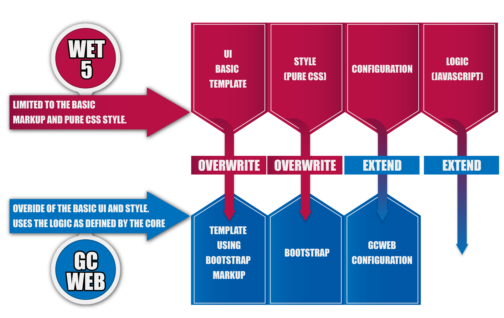
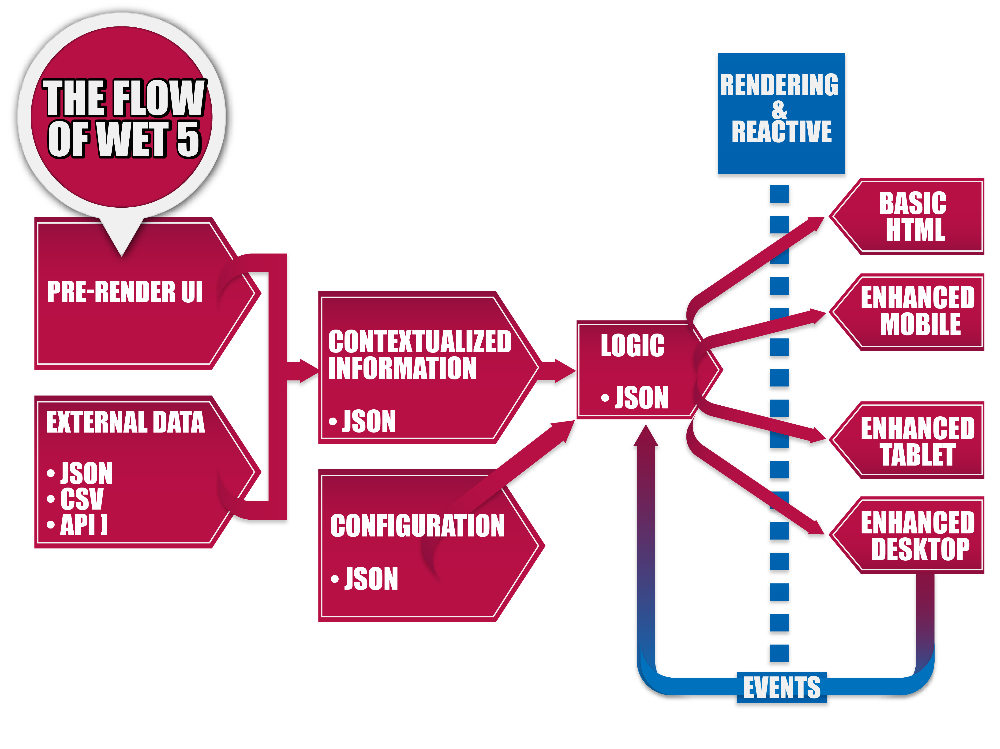
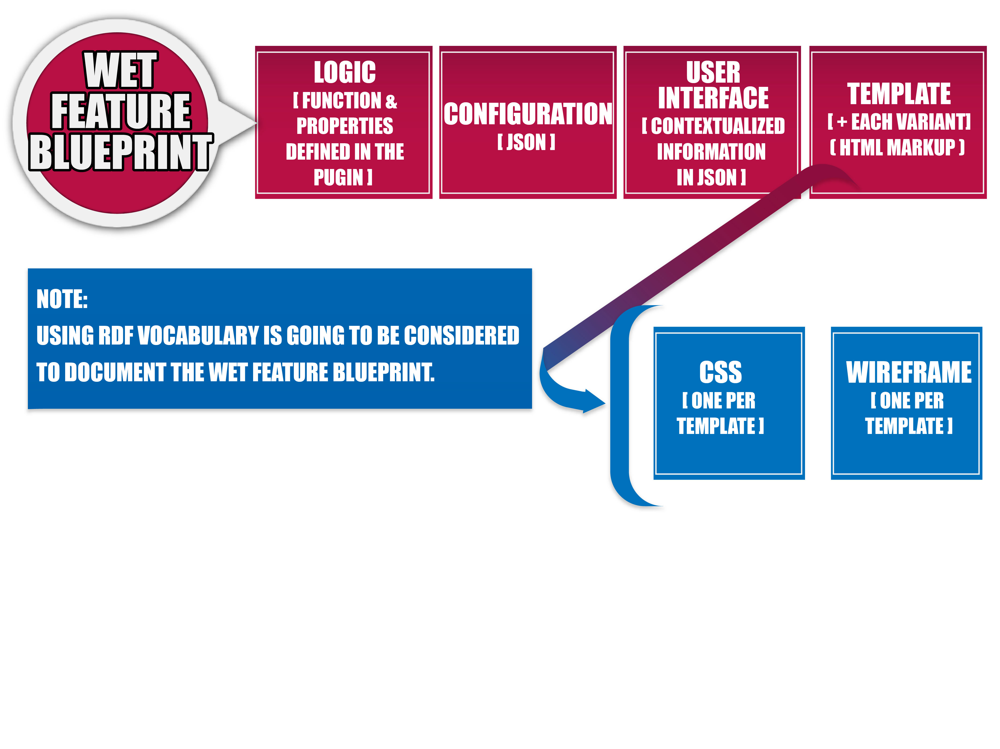
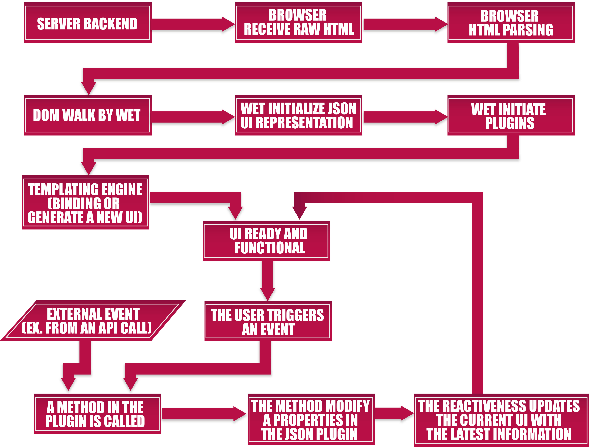

Documentations material presented at the WET 5 framework development kick off meeting on May 10, 2018. 

{::nomarkdown}



<div class="alert alert-info">
	<p>The information on this page might be already superseeded and might not represent the actual status of the WET 5 framework development.</p>
</div>


{:/}


## Kickoff meeting event description


The new WET 5 would need to :
* Better support development of:
	* Single page application (SPA)
	* Traditional multi page application
* Stronger focus on accessible version of interactive UI
* More modular and re-usable
* Reduced learning curve for developers
* Better documentation (more working examples, WET feature blueprint)
* Separate the UI from the logic. Like allowing to a way quickly switch from an initial UI enhanced state into a Basic HTML UI state. And to not prescribe a specific CSS framework to implementer.
* Connect with web services provided by Restfull API, GraphQL API and SPARQL.
 
The meeting goal is:
* Create sub working group to initiate the work on WET 5.
* Present a few core concept targeted for WET 5
* Presentation of sub working group themes like:
	* WCAG 2.1 Level AA review
	* WET Feature blueprint
	* WET 5 core
		* Core
		* Plugin structure
		* File system structure
		* Plugin manifest
		* JS/CSS dependency loading
		* Virtual DOM
	* Web site / blog / communication
	* WET 4 to WET 5 migration
		* Move of WET 4 plugin to WET 5
		* Migration tools
	* Internationalisation (i18n)
	* uild of WET 5 and continuous integration (Travis-CI)


### You want to participate

Let us knowby contacting Pierre Dubois. You can find his contact info on [GCCollab](https://gccollab.ca/profile/Pierre.Dubois) or on [GCConnex](https://gcconnex.gc.ca/profile/duboisp) or by opening a [github issue](https://github.com/wet-boew/wet-boew/issues)

## Links

* [Combobox prototype 7](http://wet-boew.github.io/wet-boew-documentation/research/2018-1-combobox-prototype-7.html)
* [Github issue: WET API/Bluprint](https://github.com/wet-boew/wet-boew/issues/8358)
* [Github issue: Basic HTML mode and progressive enhancement](https://github.com/wet-boew/wet-boew/issues/8357)

## Template sample

```
<template id="combobox_simple_template">

	<div class="combobox-wrapper">
		<div role="combobox" aria-expanded="false" aria-haspopup="listbox" data-wb5-bind="aria-owns@popupId">
			<input autocomplete="off" data-rule-fromListbox="true" data-wb5-bind="id@fieldId, aria-controls@popupId, name@fieldName, value@selectValue" aria-autocomplete="list" aria-activedescendant="" required />
		</div>
		<div data-wb5-bind="id@popupId" role="listbox" class="hidden">
			<template data-slot-elm="" data-wb5-template="sub-template-listbox">
				<ul class="list-unstyled">
					<li 
						class="brdr-bttm" 
						role="option" 
						data-wb5-for="option in options" 
						data-wb5-if="!parent.filter.length || option.value.indexOf(parent.filter) !== -1"
						data-wb5-on="select@select(option.value); live@parent.nbdispItem(wb-nbNode)" >{{ option.textContent }}</li>
				</ul>
			</template>
		</div>
	</div>
</template>
```

## Graphic

Note: The text-alternative version will be provided later on.

### Plugin pieces and how they are extended/overwrited in themes





<details>
	<summary>Long description</summary>
	<p>There is two group:</p>
	<ul>
		<li>WET 5, Limited to the basic markup and pure CSS style</li>
		<li>GCWeb, Overide of the basic UI and Style. Uses the logic as defined by teh core</li>
	</ul>
	<p>There is four component in WET 5. The description also describe the relationship with GCWeb theme.</p>
	<dl>
		<dt>UI basic template</dt>
		<dd>It can be overwrite for GCWeb and became a template using bootstrap markup</dd>
		<dt>Style (Pure)</dt>
		<dd>It can be overwrite for GCWeb and became bootstrap</dd>
		<dt>Configuration</dt>
		<dd>It can be extend and became a GCWeb configuration</dd>
		<dt>Logic (javascript)</dt>
		<dd>It can be extended, but it will be mostly be re-used as is.</dd>
	</dl>
</details>



### Flow of WET 5 internal



<details>
	<summary>Long description</summary>
	<p>The following are two entry that merge into the Contextualized information (JSON)</p>
	<ul>
		<li>Pre-render UI</li>
		<li>External data (JSON, CSV, API)</li>
	</ul>
	<p>The "Contextualized information (JSON)" are merged in the "Logic (JSON)" along with the "Configuration (JSON)"</p>
	<p>The "Logic (JSON)" would render the UI with a reactiveness the following sample template</p>
	<ul>
		<li>Basic HTML</li>
		<li>Enhanced Mobile</li>
		<li>Enhanced Tablet</li>
		<li>Enhanced Desktop</li>
	</ul>
	<p>The UI generated by those template would be able to trigger events that would dealt with the "Logic (JSON)"</p>
</details>


### WET feature blueprint



<details>
	<summary>Long description</summary>
<ul>
	<li>Logic (Function and properties defined in the plugin)</li>
	<li>Configuration (JSON)</li>
	<li>User interface (Contextualized information in JSON)</li>
	<li>Template (Plus each variant) (HTML markup)
		<ul>
			<li>CSS (One per template)</li>
			<li>Wireframe (one per template)</li>
		</ul>
</li>
</ul>
<p>Note: Using RDF vocabulary is going to be considered to document the WET feature blueprint</p>
</details>


### WET 5 live cycle flow



<details>
	<summary>Long description</summary>
	<ol>
		<li>Server backend</li>
		<li>Browser receive RAW HTML</li>
		<li>Browser HTML Parsing</li>
		<li>DOM Walk by WET</li>
		<li>WET initialize JSON UI representation</li>
		<li>WET initiate plugins</li>
		<li>Templating engine (Binding or generate a new UI)</li>
		<li>UI Ready and functional</li>
		<li>The user triggers an Event</li>
		<li>A method in the plugin is called</li>
		<li>The method modify a properties in the JSON plugin</li>
		<li>The reactiveness updates the current UI with the latest information</li>
		<li>Go back at item 8 - The UI ready and functional</li>
	</ol>
	<p>External event (Ex. from an API call) would go back at item 10 (A method in the plugin is called) in the previous list</p>
	<p>Item 1 to 3 are browser manipulation</p>
	<p>Item 4 to 6 are WET initialization work</p>
	<p>Item 7 and all the rest is the live cycle of plugin</p>
</details>




## Summary of the meeting

Drafting in progress
