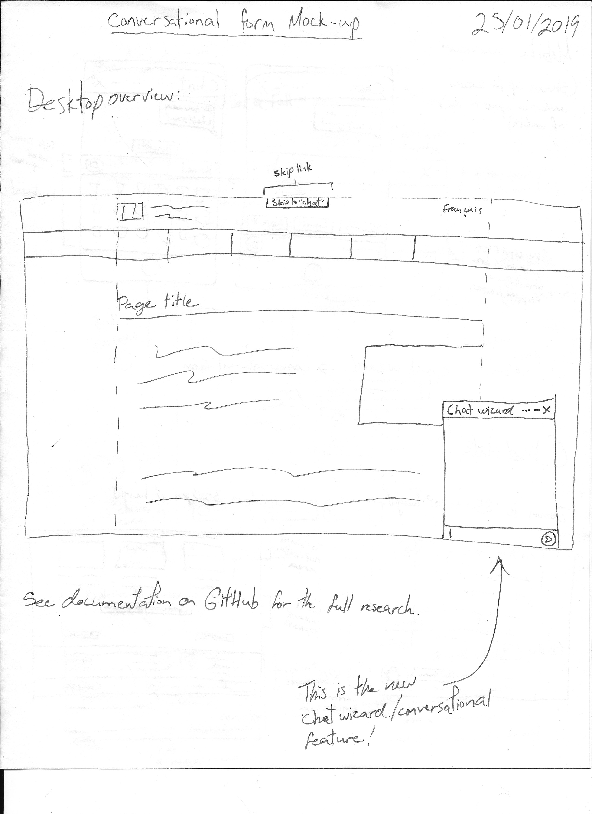
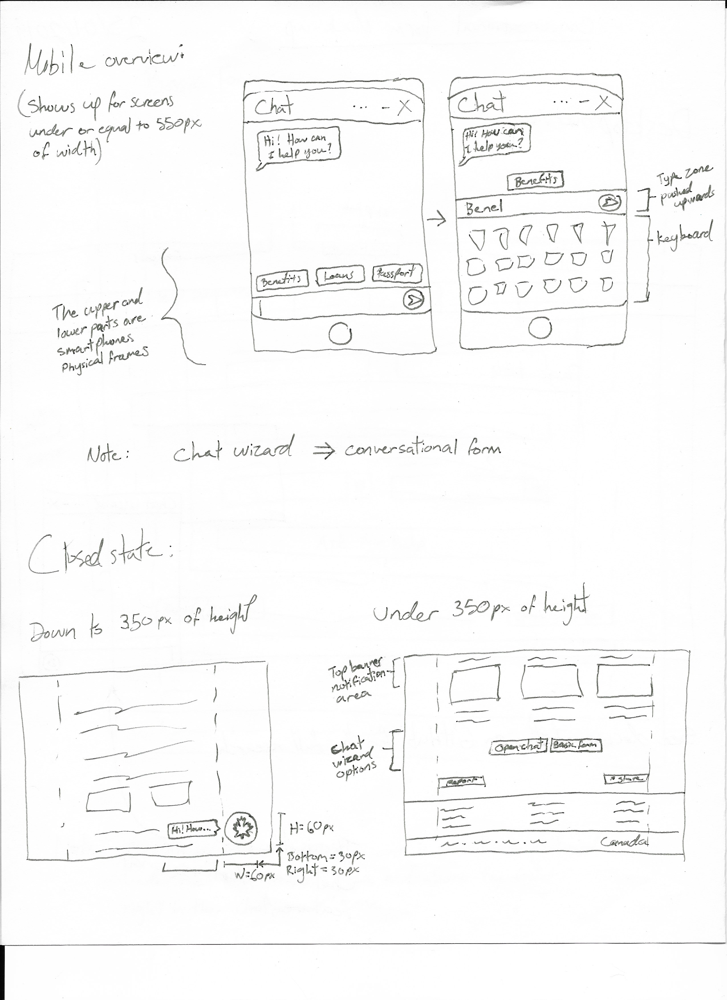
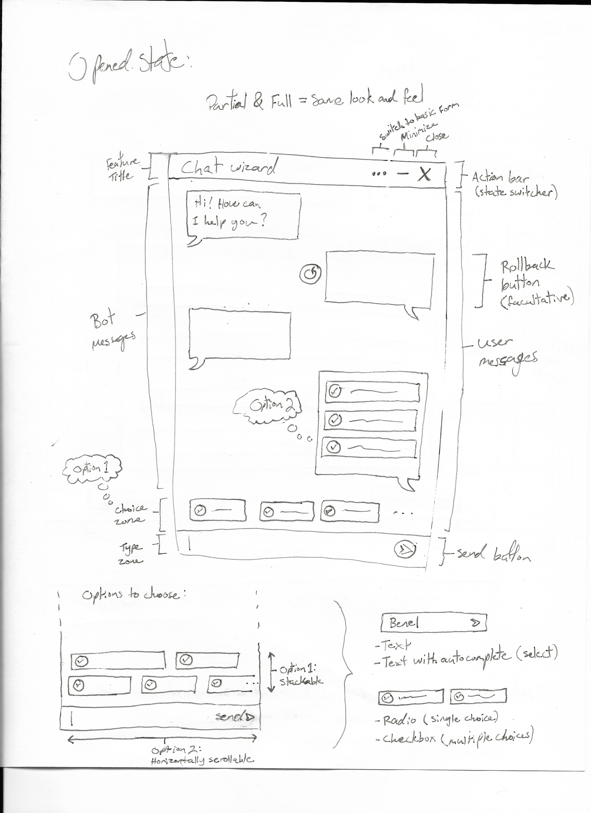
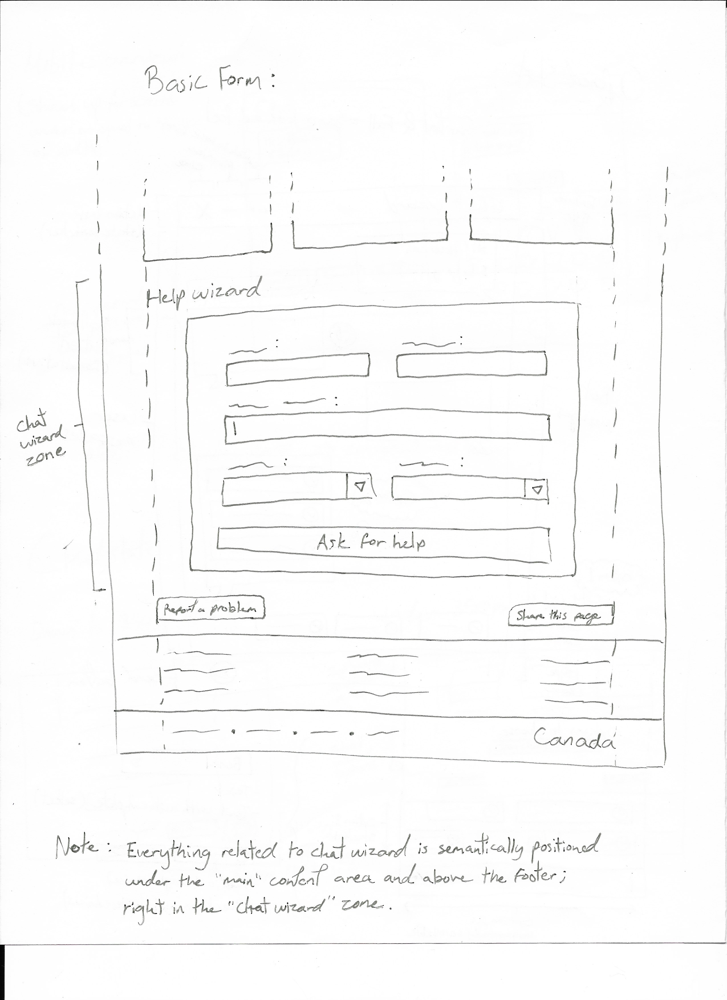

## Goal

* Evaluate the accessibility level of a chat like web interface.
* Draft a list of some technical accessibility design requirement.
* Draft an high level plan.
* Prototype that plan.
* Improve that prototype.
* Go Live.

## Some existing tools

### BotUI

* Github: [https://github.com/botui](https://github.com/botui)
* Example: [A JavaScript framework to build UI for your bot](https://botui.org/)

Good starter kit / example to build a simple, reliable, robust, and nonetheless accessible bot. 

### Quriobot

* Example: [Build your own chatbot](https://quriobot.com/)

Neat design and well built features wise. The possibility to go back in the conversation and the UI feedback on every input keeps the user engaged and supported in their journey.

### Landbot.io

* Example: [Transforms websites into Conversational Experiences](https://landbot.io/)

Pretty straight forward example of what a conversational form is conceptually. Note that there is a possibility to resume a conversation that happened in the past, which is a great feature in theory. In the back-end, a decision tree is defined on a draw board, which makes it easy to build your own conversational form or chat bot.

### Conversatinal-form

* Github: [https://github.com/space10-community/conversational-form](https://github.com/space10-community/conversational-form)
* Example: [Turning webforms into conversations](https://space10-community.github.io/conversational-form/landingpage/)

Visually, esthetically, the interaction pattern and it's configuration look easy to use from a author perspective. It's rendered interactive user interface of a chat provide a nice user perception of an intimate website experience.

However, a quick look at the rendered content markup and the source code of the page has revealled a lot of web accessibilty error and potential error. Baed on the type of error there could be a considerable effort and testing to make that feature conforming to the web accessibility guideline.

The conversation flow seems to be set into one unique path.  

#### Findings

* Nice concept of tranforming a simple form into a conversation.
* There is a lot of web-components.  More HTML semantic that differentiate each pieces of the conversation like a list or sectioning would be a must.
* The focus are not always visible in that working example.
* We can not access to all controls via the keyboard. For example the toogle to switch the conversation into a form and vice-versa.
* Answer provided in the conversation can be removed or modified. It can only be done via mouse, not keyboard operable, and its behaviour aren't fully predictable in that UI. One click modify and the second click delete the last answer.
* There is an attribute "role" that have an invalid value and there various other minor markup issue.
* The input in the conversation are validated, like if the question require an email, the converstaion verifiy if the email is valid, but it only show the error in the input placeholder and are not persistant.
* All the field seem to be required, even the ones that are not marked as optional in the source code. But if the input is a type-text, it accept empty value.

## Plan draft

* Concept
	* Create wireframe.
	* List a few basic requirement to meet web accessibility
	* Create a story that illustrate each iteraction scenario/functionality of the enhancned interface.
	* Do an environmental scan of existing similar tools
* Feature integration
	* Create wireframe
	* Create functional HTML prototype
	* Test for WCAG 2.0 Level AA conformance
* Enhanced interface
	* Create static HTML prototype (markup snapshoot) of the whole conversation for each key functionality.
	* Test those prototype for WCAG 2.0 Level AA conformance
* Basic interface
	* Define the basic HTML markup that are going to be enhanced into a conversation
	* List all the configurations option required for the conversation enhancement.
	* Create prototype of the basic HTML markup
	* Test those prototype for WCAG 2.0 Level AA conformance
* Interaction developement (JS/CSS)
* Testing and debugging
* Documentation
* Other requirement for publishing the feature in wet-boew

## Requirement and idea of suggestion

### Web accessibility 
* Ensure that all control can be controled via keyboard
* Feature integration ( page wide )
	* Have the button to open up the conversation after and outside the main content of the page, unless it's going to be specific at the page content (to discuss).
	* Add a "skip to conversion" in the skip navigation links
	* The button should become static after the main content when the page footer become visible (to discuss).
* Feature integration (in page)
	* Ensure the surrounding text introduce the conversation and provide the static form alternative version
* Enhanced interface
	* Can use CSS to have the button floating in the bottom-right, but this should be reviewed in small screen.
	* When activated, there must be a way for a screen reader user to navigate through both versions and how they can switch between basic and enhanced.
	* The conversion should be in a list or section.
	* A skip link, after the input should be provided to jump in the past conservation.
	* Ensure the interface contain all the necessary instruction, like how to modify what has been entered, etc...
	* Make the update/delete label clear. Use a combination of text and icon. 
	* Let optional field to be optional (like able to skip) and idem for the required field.
* Basic interface
	* No floating button in the UI
	* Have the form hard coded after the button
	* Can consider to add the form inside an expand collapse.

### Enhanced interface

* The configuration should be integrated in the basic html interface.
* Set the configuration to the label if those are used as such in the conversation UI
* Set the configuration to the input if those are related to the input and the data collected
* For radio or checkbox, use the legend of the fieldset container as the "configurable label". Other makrup can be consider, like heading but we should target for a consistant markup.

### Sizes

The thresholds are:
* Under and equal to 350 pixels of height:
	* Basic interface is visible. Static button, on-page wizard and top banner notifications are used.
* Above 350 pixels of height:
	* Enhanced interface is visible. Floating button and notification badges are used.
* Under or equal to 550 pixels of width:
	* Enhanced interface is visible. Floating button, notification badges and fullscreen wizard are used.
* Above 550 pixels of width:
	* Enhanced interface is visible. Floating button, notification badges and overlay wizard are used.

### Rules

* All fields must be required for now. Or, include a version with all fields being optional in a future release
* User must be able to switch between basic form and conversational form (chat wizard) at all time
* Form has to be linear, which means no decisional tree, only one path
* No Form validation should be used, only inputs allowed are:
	* Text
	* Radio
	* Checkbox
	* Select
* Form submition must be handled client-side only

### Accessibility

On the accessibility side, the followings are potentially at risk: 

* The submit button becomes disabled when the question change;
* The wait time between questions, when the bot speaks, etc.

### To think about

* What to do with the print version (if applicable).
* Change the plugin's name? Currently: Chat Wizard.
* Add a "skip to chat wizard" in the skip navigation links?
* Remove the conversation when the back button is hit on the results page?
* Add handler for Select tags.

### First Release

* Supports radio buttons only.
* No basic html interface support.
* No "Skip this step" or "Back one step" links.
* No "Edit answer" button to roll-back in the conversation.
* Fields in the form can be optional, but they are all required in the chat (you have to finish your conversation).

## Wireframe and Prototyping

Semantically, the entire code related to the chat wizard should be located right after the closing main tag, assuming the chat is general and not directly related to the content. If the chat is related to the context of the page, then it should be placed underneath the H1 tag, rught before the first H2.

### Closed State

The closed state is a state in which the user can only see a floating chat "bubble" to open the wizard, if the screen meets or exceed the screen size requirements. Under the size requirements, a static button can be found where the rest of the semantic for the wizard is.

#### Submit basic form

Needs content here.

### Stand-By State

In this state, the user hasn't opened the wizard yet, so the feature is equal to the Closed state. What differenciate the Stand-by state with the Closed one, Stand-by encourages the user to click on the bubble to open the wizard, with a notification.

### Opened State

#### Overlay

See images below. This is where the core of the feature is.

#### Fullscreen

Same window as in the overlay version, but taking the entire screen.

#### Basic Form

Simple plain form as an alternative to the conversational form, spitting out the same results at the end of the line.

### Focus order

Default focus order matches the document structure, which is top to bottom and left to right. The focus is cyclic and keeps the user trapped in the form, but it can be escaped by selecting the close button at the end of the cycle. When the user sends a message, the next focus 

### Actions

#### Submit button and options

Options are inputs to fill, while Submit button sends the selected input value to the conversation in a message from the user, in answer to the question from the bot.

#### Minimize button

This button minimizes the chat wizard to its initial close state, but keeps the conversation "active". Opening it back would resume the conversation from where it was left off.

#### Switch button

This button makes a switch between the conversational form and the basic form. It can be found in the header of the chat window.

### Visual 

{::nomarkdown}



	

		

			

				

					
Desktop

					

						
					

				

				

					
Mobile

					

						
					

				

				

					
Window

					

						
					

				

				

					
Form

					

						
					

				

			

		

	


{:/}

### Prototypes

* [Concept Prototype](https://gormanproductions.ca/lab/chat-wizard-prototype/chat-bot-en.html)
* Prototype 1 (Presented underneath this list.)
* [Prototype 2](../research/2019-15-exploration-chat-pattern-prototype-2.html)
* [Prototype 3](../research/2019-15-exploration-chat-pattern-prototype-3.html)
* [Prototype 4](../research/2019-15-exploration-chat-pattern-prototype-4.html)
* [Prototype 5](../research/2019-15-exploration-chat-pattern-prototype-form.html)
* [First Demo](../research/2019-15-exploration-chat-pattern-demo.html)

#### Prototype 1

Markup Basic Structure

{::nomarkdown}



See HTML Code

<pre>
<code>
&lt;aside class="chtbt-container"&gt;
	&lt;header class="chtbt-header"&gt;
		&lt;h2 class="chtbt-title"&gt;I can help you find the information you need&lt;/h2&gt;
	&lt;/header&gt;
	&lt;div class="chtbt-body"&gt;
		&lt;div class="chtbt-message-container"&gt;
			&lt;h3 class="wb-inv"&gt;Conversation history&lt;/h3&gt;
			&lt;section&gt;
				&lt;div class="row"&gt;
					&lt;div class="col-xs-9"&gt;
						&lt;div class="chtbt-message"&gt;
							&lt;div class="chtbt-bot-avatar"&gt;
								&lt;span class="glyphicon glyphicon-user"&gt;&lt;/span&gt;
							&lt;/div&gt;
							&lt;h4&gt;Hi! I can help direct you to programs and services you might be interested in. Would you like to get started by answering a few questions?&lt;/h4&gt;
						&lt;/div&gt;
					&lt;/div&gt;
				&lt;/div&gt;
				&lt;div class="row"&gt;
					&lt;div class="col-xs-9 col-xs-offset-3"&gt;
						&lt;div class="chtbt-message"&gt;
							&lt;p&gt;Yes&lt;/p&gt;
							&lt;p class="chtbt-rollback"&gt;&lt;a href="#"&gt;Modify this answer&lt;/a&gt;&lt;/p&gt;
						&lt;/div&gt;
					&lt;/div&gt;
				&lt;/div&gt;
			&lt;/section&gt;
		&lt;/div&gt;
		&lt;form class="chtbt-interaction-container"&gt;
			&lt;h3 class="wb-inv"&gt;Conversation interaction&lt;/h3&gt;
			&lt;fieldset&gt;
				&lt;legend&gt;Are you:&lt;/legend&gt;
				&lt;ul class="list-inline"&gt;
					&lt;li&gt;
						&lt;label&gt;
							&lt;input type="radio" value="young" name="q2" /&gt;
							a young Canadian
						&lt;/label&gt;
					&lt;/li&gt;
					&lt;li&gt;
						&lt;label&gt;
							&lt;input type="radio" value="emloyer" name="q2" /&gt;
							an employer or organization looking for funding to support youth
						&lt;/label&gt;
					&lt;/li&gt;
				&lt;/ul&gt;
			&lt;/fieldset&gt;
			&lt;button type="submit" class="btn btn-default"&gt;Back&lt;/button&gt;
			&lt;button type="submit" class="btn btn-primary"&gt;Next step&lt;/button&gt;
			&lt;button type="submit" class="btn btn-link"&gt;Skip this step&lt;/button&gt;
		&lt;/form&gt;
	&lt;/div&gt;
&lt;/aside&gt;
</code>
</pre>


{:/}

### Data API

Here is the JavaScript Object that is being generated and that must be followed in order to make the magic work.

[Data API](../research/2019-assets/chtwzrd/js/botapi.js)

### Alpha Version

[See the Alpha Version](../research/2019-15-exploration-chat-pattern-alpha.html)

## Notes on assessments (WCAG2.0, Screen Readers and other tests)

* With the text zoomed at 200%, Wizard's title gets cut vertically.
* The answer gets the :focus after replying (on purpose). This behaviour is to be investigated.
* NVDA screen reader repeats the answer given twice.
* Wizard window's title is omitted using the NVDA screen reader.
* No form validation is being done at all.
	* In basic mode, submitting at a random point will technically work, and will send the form to point where it was at.
	* In chat mode, the first input will automatically be selected if no input is given.
* Dynamic positionning of the bubble could potentially fail on page load, and place the bubble mid-screen vertically.

## How-to

In order to be configured properly, you need the following:

* Add a form to a page and include the "wb-chtwzrd" class to either the form or its container (if it is contained in a row on its own).
* In the form tag, you must have a filled action attribute and you must include a data-attribute named "data-wb-chtwzrd", with the following properties inside of it, in brackets {}:
	* formType: "dynamic" or "static". (Optional, "dynamic" by default) A dynamic form will be needed if you can assume that the next question is dependent on the answer provided. Use "static" if you are using a static form, or other kinds of plugins affecting your form. 
	* sendWizard: "string". This text is the value of the button at the end of the conversation in the chat.
	* titleWizard: "string". Title of the chat, showing in the chat window banner, as well as in the notification popup.
	* startText: "string". Greeting message from the chat. THis is the very first message that the bot will send in the conversation, before the questions.
	* endText: "string". This is the last goodbye from the bot after all of the questions have been answered.
	* first: "1". Identifies the first question after the bot's greetings, by qID.
* A second "greeting" message from the bot can be added in a paragraph before the questions, in order to provide extra information or instructions. This is optional. In the case where this message should be different from the paragraph in the basic form, the data-attribute "data-chtwzrd-intro" can be used to provide a different text.
* Regarding the questions, the only inputs that can be handled by the plugin are radio buttons at the moment. A proper HTML markup must be used for the plugin to catch them. The following structure is to be followed:
	* fieldset > legend > input.
* Along with the proper markup, a data-attribute called "data-chtwzrd-q" must be added to every legend tag containing the inputs, with the following properties:
	* qId: "1". Question Identifier.
	* labelWizard: "Are you:". Question shown in the chat. This data-attribute is required, even if the text is the same as in the actual legend tag.
* Every single input tag must have a data-attribute called "data-chtwzrd-a", containing the following properties: 
	* next: "2". Identifies which question is next if this option is selected, by qID.
	* url: "wxyz.html". If this option modifies the form's action at the end, this attribute will change it. Note that If you change the action to "abc.html" at question #2, then the action will remain "abc.html" for the rest of the form until you change it again in a further answer.
* Also, the name and the value attributes of the inputs are used as parameters in the form submit, like any regular form with a GET method.
* The text value placed after your input must be wrapped around an HTML tag, like a span, and you can use the "no-chtwzrd" class on an element if you want to ignore it from the text value, e.g. an image.
* Note: You can have any containers you want for your form, as long as you wrap it all inside the "wb-chtwzrd" class. The toggle would affect the spacing in your page if you don't wrap it all.

## Example

{::nomarkdown}


This is your HTML code

<pre>
<code>
&lt;div class="container wb-chtwzrd"&gt;
	&lt;div class="row"&gt;
		&lt;section class="col-md-12"&gt;
			&lt;h2&gt;Help us help you&lt;/h2&gt;
			&lt;form class="mrgn-bttm-xl" data-wb-chtwzrd='{"sendWizard":"Show results", "first":"q1", "titleWizard":"I can help you find the information you need", "startText":"Hi! I can help direct you to programs and services you might be interested in. Let&apos;s begin...", "endText":"Thank you. I have built a page with results you may find resourceful."}' action="page1.html"&gt;
				&lt;p data-chtwzrd-intro='First, if you are an employer or organization looking for funding, you can find relevant information on the &lt;a href="pagex.html"&gt;funding page&lt;/a&gt;.'&gt;If you are an employer or organization looking for funding, you can find relevant information on the &lt;a href="pagex.html"&gt;funding page&lt;/a&gt;.&lt;/p&gt;
				&lt;fieldset&gt;
					&lt;legend data-chtwzrd-q='{"labelWizard":"Are you:", "qId":"q1"}'&gt;What would you describe yourself as?&lt;/legend&gt;
					&lt;ul class="list-unstyled mrgn-tp-md"&gt;
						&lt;li&gt;
							&lt;label&gt;
								&lt;input type="radio" value="young-canadian" name="describe" data-chtwzrd-a='{"next":"q2"}' /&gt;
								&lt;span&gt;a young Canadian&lt;/span&gt;
							&lt;/label&gt;
						&lt;/li&gt;
						&lt;li&gt;
							&lt;label&gt;
								&lt;input type="radio" value="employer-organization-funding-support-youth" name="describe" data-chtwzrd-a='{"next":"none", "url":"page2.html"}' /&gt;
								&lt;span&gt;an employer or organization looking for funding to support youth&lt;/span&gt;
							&lt;/label&gt;
						&lt;/li&gt;
						&lt;li&gt;
							&lt;label&gt;
								&lt;input type="radio" value="none-above" name="describe" data-chtwzrd-a='{"next":"q3"}' /&gt;
								&lt;span&gt;None of the above&lt;/span&gt;
							&lt;/label&gt;
						&lt;/li&gt;
					&lt;/ul&gt;
				&lt;/fieldset&gt;
				&lt;fieldset&gt;
					&lt;legend data-chtwzrd-q='{"labelWizard":"Great! And are you:", "qId":"q2"}'&gt;In what situation are you?&lt;/legend&gt;
					&lt;ul class="list-unstyled mrgn-tp-md"&gt;
						&lt;li&gt;
							&lt;label&gt;
								&lt;input type="radio" value="high-school" name="situation" data-chtwzrd-a='{"next":"q3"}' /&gt;
								&lt;span&gt;a high school student&lt;/span&gt;
							&lt;/label&gt;
						&lt;/li&gt;
						&lt;li&gt;
							&lt;label&gt;
								&lt;input type="radio" value="cegep-student" name="situation" data-chtwzrd-a='{"next":"q3"}' /&gt;
								&lt;span&gt;a CÉGEP student&lt;/span&gt;
							&lt;/label&gt;
						&lt;/li&gt;
						&lt;li&gt;
							&lt;label&gt;
								&lt;input type="radio" value="post-secondary" name="situation" data-chtwzrd-a='{"next":"q3"}' /&gt;
								&lt;span&gt;a post-secondary school student&lt;/span&gt;
							&lt;/label&gt;
						&lt;/li&gt;
					&lt;/ul&gt;
				&lt;/fieldset&gt;
				&lt;fieldset&gt;
					&lt;legend data-chtwzrd-q='{"labelWizard":"Awesome! And would you like to:", "qId":"q3"}'&gt;What is your goal?&lt;/legend&gt;
					&lt;ul class="list-unstyled mrgn-tp-md"&gt;
						&lt;li&gt;
							&lt;label&gt;
								&lt;input type="radio" value="get-job" name="goal" data-chtwzrd-a='{"next":"none", "url":"page3.html"}' /&gt;
								&lt;span&gt;get a job&lt;/span&gt;
							&lt;/label&gt;
						&lt;/li&gt;
						&lt;li&gt;
							&lt;label&gt;
								&lt;input type="radio" value="develop-skills" name="goal" data-chtwzrd-a='{"next":"none", "url":"page4.html"}' /&gt;
								&lt;span&gt;develop skills&lt;/span&gt;
							&lt;/label&gt;
						&lt;/li&gt;
						&lt;li&gt;
							&lt;label&gt;
								&lt;input type="radio" value="explore-careers" name="goal" data-chtwzrd-a='{"next":"none", "url":"page5.html"}' /&gt;
								&lt;span&gt;explore careers&lt;/span&gt;
							&lt;/label&gt;
						&lt;/li&gt;
					&lt;/ul&gt;
				&lt;/fieldset&gt;
				&lt;br/&gt;
				&lt;button type="submit" class="btn btn-sm btn-primary"&gt;Search&lt;/button&gt;
			&lt;/form&gt;
		&lt;/section&gt;
	&lt;/div&gt;
&lt;/div&gt;
</code>
</pre>


{:/}

## To do

* FRENCH VERSION.
* Fix potential accessibility issues.

## Improvements planned

* Accepting JSON File as an input for batch deployments.
* Working with checkboxes (with the constraint of having either all the checkboxes going to the same form action or not changing the form action at all for checkboxes).