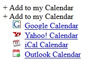

**Project lead:** Eric Guitard

Add to calendar functionality

## Requirements

* As a publisher, I would like to have a new widget to allow visitors to save events to their devices' calendars, so that visitors can access information related to events from their personal devices.
* As a visitor to a GoC website I would like to be able to save event details, specifically: Title, Start time, End time, Location and Description to my device's calendar so that I can access them from my device.
* As a visitor, I would like this feature to be compatible with Google calendar, Outlook, Apple and Android devices, so that multiple devices are able to save events.

Support Schema.org vocabulary for Event thing marked by using RDFa Lite

## Existing tools reviews

### carlsednaoui OuiCal

* github:(https://github.com/carlsednaoui/add-to-calendar-buttons)
* working example: 
	* [Add-to-calendar buttons/example] (http://carlsednaoui.github.io/add-to-calendar-buttons/example.html)

#### Visual

* Clickable expandable collapsable item to preview the calendar link options

### [iCal Event Maker - create iCalendar (.ics)] (https://ical.marudot.com/)

## Related standard and references

* [rfc5545 - Internet Calendaring and Scheduling Core Object Specification] (https://tools.ietf.org/html/rfc5545)
* [iCalendar.org - iCalendar Resources, Specifications and Tools] (https://icalendar.org/)
* [Shhema.org - Envent] (https://schema.org/Event)
* [W3c - Date and Time Formats] (https://www.w3.org/TR/NOTE-datetime)
* [Google Calendar URL Structure] (https://github.com/InteractionDesignFoundation/add-event-to-calendar-docs/blob/master/services/google.md)
* [Making a Google Calendar Link] (http://useroffline.blogspot.com/2009/06/making-google-calendar-link.html)

## Discussions and findings

* Initial thougth was for authors to create the ics file and Google link manually and add event details using RDFa markup of schema.org/Event pattern.
* For grouping and having the expand/collapse functionality for the 3 calendar links (Google, Apple and Other), 2 solutions were considered:
	* Using a checkbox input type with the aspect of a button.
	* Using list items inside a details summary tag.
* After few discussions and testing, a recommandation for creating a blob for the .ics file via the wb.download functionality from the existing action manager WET pluggin as been considered. 

## Wireframe and template

* [Prototype 1 - Include 2 initial design patterns:](../wet-boew-documentation/research/2019-19-add-calendar-prototype-1.html)
* [Prototype 2 - Latest version created using details summary:](../wet-boew-documentation/research/2019-19-add-calendar-prototype-2.html)

