# **Short review of GCWEB THEME on its accessibility and usability for people with disabilities**

**Disclaimer:** This document is a short, follow up review. Its main purpose is to raise awareness for education and training purposes. This document is also meant to help to bring the product to be fully accessible for all users including people with disabilities.

**Note:** AAACT at SSC is assessing this product solely for informational purposes.  Please note that this assessment does not constitute a representation that this product meets the needs of the Government of Canada, or a commitment on the part of the Government of Canada to purchase any such products.

## Scope of review
**Reviewed on 2019-07-16**

The AAACT Program tested 2 pages of this application. They are listed below: 

Page 1: “Content” [https://wet-boew.github.io/themes-dist/GCWeb/content-en.html](https://wet-boew.github.io/themes-dist/GCWeb/content-en.html)

Page 2: “Performance” [https://wet-boew.github.io/themes-dist/GCWeb/institutional-service-performance-en.html](https://wet-boew.github.io/themes-dist/GCWeb/institutional-service-performance-en.html)

**Notes:**

1.	All comments in the document refer to both English and French pages unless specified otherwise. 
2.	Testing done using: Chrome 75, NVDA 2018, keyboard-only
3.	Pages were tested against WCAG 2.1 level A, AA

## Table of Contents

1. [Scope of review](#user-content-scope-of-review)
2. [Table of Contents](#user-content-table-of-contents)
3. [General Notes](#user-content-general-notes)
4. [Usability Comments](#user-content-usability-comments)
5. [WCAG 2.1 accessibility issues levels A, AA and AAA](#user-content-wcag-21-accessibility-issues-levels-a-aa-and-aaa)
    * 1.1 Text Alternatives
    * 1.2 Time-based Media
    * 1.3 Adaptable
    * 1.4 Distinguishable
    * 2.1 Keyboard Accessible
    * 2.2 Enough Time
    * 2.3 Seizures
    * 2.4 Navigable
    * 2.5 Input Modalities 
    * 3.1 Readable
    * 3.2 Predictable
    * 3.3 Input Assistance
    * 4.1 Compatible

## General Notes


## Usability Comments
1.	At high zoom, list items can break across columns, making them hard to identify as a single item. Below, “Treaties, laws and regulations” is split across columns as is “About Canada.ca”

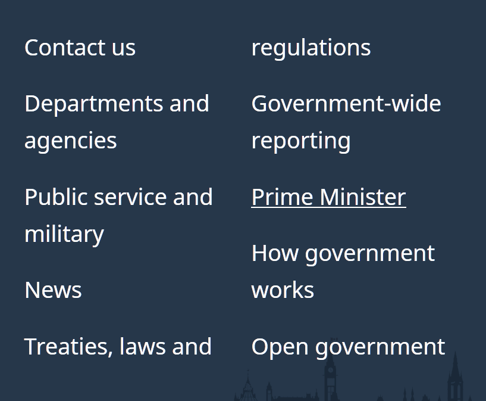
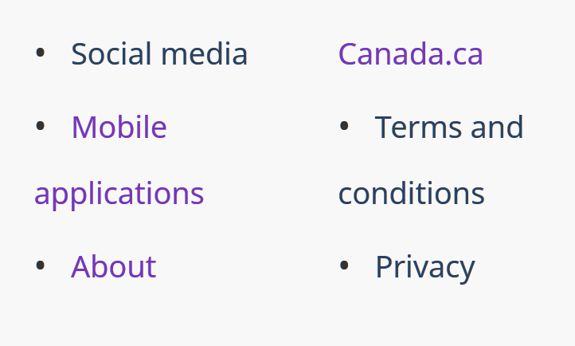

2.	On mobile, the “Share this page” modal does not prevent scrolling outside the modal. This can make the modal hard to locate and results in a blank screen when swiping up (with the intention of returning to the top of the modal, not some blank region above the modal).

3.	In the mobile menu, certain menu items are styled differently, although they behave the same as other items. This is confusing, as change in background color is used elsewhere (including within this menu) to indicate focus state. 

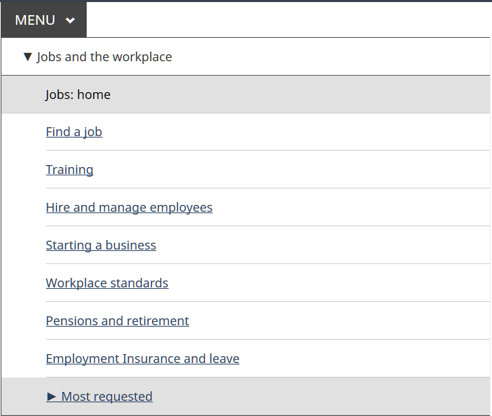

Above, neither “Jobs: home” nor “Most requested” are focused or hovered. Note that “Jobs: home” is also missing the underline style – why?

4.	“Search” button might be better named “Search submit” to distinguish the button from the form field “Search Canada.ca”

## WCAG 2.1 accessibility issues levels A, AA and AAA
### 1.1 Text Alternatives
[1.1.1 Non-text content (Level A)](https://www.w3.org/WAI/WCAG21/Understanding/non-text-content)

1. pass

### 1.2 Time-based Media
[1.2.1 Audio-only and Video-only (prerecorded) (Level A)](https://www.w3.org/WAI/WCAG21/Understanding/audio-only-and-video-only-prerecorded)

1. n/a

[1.2.2 Captions (prerecorded) (Level A)](https://www.w3.org/WAI/WCAG21/Understanding/captions-prerecorded)

1. n/a

[1.2.3 Audio Description or Media Alternative (prerecorded) (Level A)](https://www.w3.org/WAI/WCAG21/Understanding/audio-description-prerecorded)

1. n/a

[1.2.4 Captions (Live) (Level AA)](https://www.w3.org/WAI/WCAG21/Understanding/captions-live)

1. n/a

[1.2.5 Audio Description (prerecorded) (Level AA)](https://www.w3.org/WAI/WCAG21/Understanding/audio-description-prerecorded)

1. n/a

[1.2.6 Sign Language (Prerecorded) (Level AAA)](https://www.w3.org/WAI/WCAG21/Understanding/sign-language-prerecorded)

1. n/a

[1.2.7 Extended Audio Description (Prerecorded) (Level AAA)](https://www.w3.org/WAI/WCAG21/Understanding/extended-audio-description-prerecorded)

1. n/a

[1.2.8 Media Alternative (Prerecorded) (Level AAA)](https://www.w3.org/WAI/WCAG21/Understanding/media-alternative-prerecorded)

1. n/a

[1.2.9 Audio-only (Live) (Level AAA)](https://www.w3.org/WAI/WCAG21/Understanding/audio-only-live)

1. n/a

[1.2.5 Audio Description (prerecorded) (Level AA)](https://www.w3.org/WAI/WCAG21/Understanding/audio-description-prerecorded)

1. n/a

### 1.3 Adaptable
[1.3.1 Info and Relationships (Level A)](https://www.w3.org/WAI/WCAG21/Understanding/info-and-relationships)

1.	content-en.html

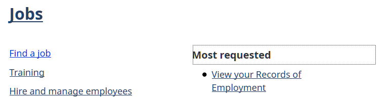

Menu contains <a> elements which are not interactive. Shown above, “Most requested” is better described as a <h>. [See Issue 1498](https://github.com/wet-boew/GCWeb/issues/1498)

[1.3.2 Meaningful Sequence (Level A)](https://www.w3.org/WAI/WCAG21/Understanding/meaningful-sequence)

1.	pass

[1.3.3 Sensory Characteristics (Level A)](https://www.w3.org/WAI/WCAG21/Understanding/sensory-characteristics)

1.	pass

[1.3.4 Orientation (WCAG 2.1 Level AA)](https://www.w3.org/WAI/WCAG21/Understanding/orientation)

1.	pass

[1.3.5 Identify Input Purpose (WCAG 2.1 Level AA)](https://www.w3.org/WAI/WCAG21/Understanding/identify-input-purpose)

1.	n/a (no inputs for gathering information about the user)

[1.3.6 Identify Purpose (WCAG 2.1 Level AAA)](https://www.w3.org/WAI/WCAG21/Understanding/identify-purpose)

1.	This criterion is insufficiently specified to be evaluated at present.

### 1.4 Distinguishable

[1.4.1 Use of Color (Level A)](https://www.w3.org/WAI/WCAG21/Understanding/use-of-color)

1.	pass

[1.4.2 Audio Control (Level A)](https://www.w3.org/WAI/WCAG21/Understanding/audio-control)

1.	pass

[1.4.3 Contrast (Minimum) (Level AA)](https://www.w3.org/WAI/WCAG21/Understanding/contrast-minimum)

1.	pass

[1.4.4 Resize text (Level AA)](https://www.w3.org/WAI/WCAG21/Understanding/resize-text)

1.	pass

[1.4.5 Images of Text (Level AA)](https://www.w3.org/WAI/WCAG21/Understanding/images-of-text)

1.	pass

[1.4.6 Contrast (Enhanced) (Level AAA)](https://www.w3.org/WAI/WCAG21/Understanding/contrast-enhanced)

1.	n/a

[1.4.7 Low or No Background Audio (Level AAA)](https://www.w3.org/WAI/WCAG21/Understanding/low-or-no-background-audio)

1.	n/a

[1.4.8 Visual Presentation (Level AAA)](https://www.w3.org/WAI/WCAG21/Understanding/visual-presentation)

1.	n/a

[1.4.9 Images of Text (No Exception) (Level AAA)](https://www.w3.org/WAI/WCAG21/Understanding/images-of-text-no-exception)

1.	n/a

[1.4.10 Reflow (WCAG 2.1 Level AA)](https://www.w3.org/WAI/WCAG21/Understanding/reflow)

1.	pass

[1.4.11 Non-Text Contrast (WCAG 2.1 Level AA)](https://www.w3.org/WAI/WCAG21/Understanding/non-text-contrast)

1.	content-en.html

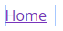

Focus indicator has low (1.7:1) contrast.

2.	content-en.html

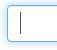

Focus indicator has low (2.4:1) contrast.

3.	content-en.html

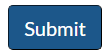


As focus indicator has insufficient contrast, focus visibility relies on change in background color, but this is also low (1.4:1) contrast.

4.	content-en.html

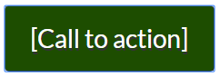
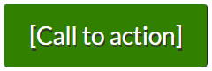

As above, low (2:1) contrast.

5.	content-en.html

(not strictly a failure in Chrome)

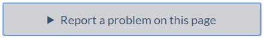
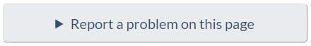

Focus indicator has sufficient contrast in Chrome, but this browser default should not be relied on. Change in background color is low (1.3:1) contrast.

6.	content-en.html


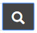

As above, but with even lower contrast between background colors of different states. In Firefox, no outline is visible so this is a clear failure.

7.	content-en.html

In Firefox, when dropdown menu is initially invoked by clicking the button, but subsequently the arrow keys are used to navigate the menu, no focus ring appears on menu items. This is an issue especially for submenu items. Apart from the focus ring, the change in style on focus is a color change from #284162 to #333, which has low (1.2:1) contrast.

[1.4.12 Text Spacing (WCAG 2.1 Level AA)](https://www.w3.org/WAI/WCAG21/Understanding/text-spacing)

1. pass

[1.4.13 Content on Hover or Focus (WCAG 2.1 Level AA)](https://www.w3.org/WAI/WCAG21/Understanding/text-spacing)

1.	(debatable, but certainly a usability issue):
The desktop menu has submenu content appear on hover or focus of a parent menu item. This cannot be “dismissed” (returned to the previous content that was explicitly activated via Enter, Right arrow, Spacebar, or click). See [Issue #1498](https://github.com/wet-boew/GCWeb/issues/1498)

### 2.1 Keyboard Accessible
[2.1.1 Keyboard (Level A)](https://www.w3.org/WAI/WCAG21/Understanding/keyboard)

The following functionality is not accessible with keyboard-only input:

1. pass

[2.1.2 No Keyboard Trap (Level A)](https://www.w3.org/WAI/WCAG21/Understanding/no-keyboard-trap)

1.	Pass

[2.1.3 Keyboard (No Exception) (Level AAA)](https://www.w3.org/WAI/WCAG21/Understanding/keyboard-no-exception)

1.	n/a

[2.1.4 Character Key Shortcuts (WCAG 2.1 Level A)](https://www.w3.org/WAI/WCAG21/Understanding/character-key-shortcuts)

1.	Pass

### 2.2 Enough Time
[2.2.1 Timing Adjustable (Level A)](https://www.w3.org/WAI/WCAG21/Understanding/timing-adjustable)

1.	n/a

[2.2.2 Pause, Stop, Hide (Level A)](https://www.w3.org/WAI/WCAG21/Understanding/pause-stop-hide)

1.	n/a

[2.2.3 No Timing (Level AAA)](https://www.w3.org/WAI/WCAG21/Understanding/no-timing)

1.	n/a

[2.2.4 Interruptions (Level AAA)](https://www.w3.org/WAI/WCAG21/Understanding/interruptions)

1.	n/a

[2.2.5 Re-authenticating (Level AAA)](https://www.w3.org/WAI/WCAG21/Understanding/re-authenticating)

1.	n/a

[2.2.6 Timeouts (WCAG 2.1 Level AAA)](https://www.w3.org/WAI/WCAG21/Understanding/timeouts)

1.	n/a

### 2.3 Seizures
[2.3.1 Three Flashes or Below Threshold (Level A)](https://www.w3.org/WAI/WCAG21/Understanding/three-flashes-or-below-threshold)

1.	Pass

[2.3.2 Three Flashes (Level AAA)](https://www.w3.org/WAI/WCAG21/Understanding/three-flashes)

1.	n/a

[2.3.3 Animation from Interactions (WCAG 2.1 Level AAA)](https://www.w3.org/WAI/WCAG21/Understanding/animation-from-interactions)

1.	n/a

### 2.4 Navigable

[2.4.1 Bypass Blocks (Level A)](https://www.w3.org/WAI/WCAG21/Understanding/bypass-blocks)

1.	Pass

[2.4.2 Page Titled (Level A)](https://www.w3.org/WAI/WCAG21/Understanding/page-titled)

1.	Pass

[2.4.3 Focus Order (Level A)](https://www.w3.org/WAI/WCAG21/Understanding/focus-order)

1.	content-en.html?wbdisable=true

Menu has different focus order depending on whether it has already been navigated through with arrow keys.

To replicate, use arrow keys to navigate the site menu, then attempt to navigate the menu using the tab key.

To resolve, prevent the menu’s arrow key handling in Basic HTML mode.

[2.4.4 Link Purpose (In Context) (Level A)](https://www.w3.org/WAI/WCAG21/Understanding/link-purpose-in-context)

1.	All pages
Footer link to “Top of Page” links to main content landmark, not the top of the page.

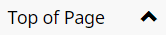

[2.4.5 Multiple Ways (Level AA)](https://www.w3.org/WAI/WCAG21/Understanding/multiple-ways)

1.	Pass

[2.4.6 Headings and Labels (Level AA)](https://www.w3.org/WAI/WCAG21/Understanding/headings-and-labels)

1.	Pass

[2.4.7 Focus Visible (Level AA)](https://www.w3.org/WAI/WCAG21/Understanding/focus-visible)

1.	See 1.4.11 Non-text contrast

2.	In Firefox, top-level menu items do not have visible focus when they are also hovered. In the screenshot below, “Benefits” is focused.


[2.4.8 Location (Level AAA)](https://www.w3.org/WAI/WCAG21/Understanding/location)

1.	n/a

[2.4.9 Link Purpose (Link Only) (Level AAA)](https://www.w3.org/WAI/WCAG21/Understanding/link-purpose-link-only)

1.	n/a

[2.4.10 Section Headings (Level AAA)](https://www.w3.org/WAI/WCAG21/Understanding/section-headings)

1.	n/a

### 2.5 Input Modalities

[2.5.1 Pointer Gestures (WCAG 2.1 Level A)](https://www.w3.org/WAI/WCAG21/Understanding/pointer-gestures)

1.	n/a

[2.5.2 Pointer Cancellation (WCAG 2.1 Level A)](https://www.w3.org/WAI/WCAG21/Understanding/pointer-cancellation)

1.	n/a

[2.5.3 Label in Name (WCAG 2.1 Level A)](https://www.w3.org/WAI/WCAG21/Understanding/label-in-name)

1.	Menu button has visible text “Menu” but aria-label “Press the SPACEBAR...” which serves as the accessible name.

I recommend that instructions be instead placed in an invisible element referenced by aria-describedby. I further recommend setting aria-label=“Menu”, as otherwise the first word in the accessible name is “Main”:
```<span class="wb-inv">Main </span>```Menu

See [button Element Accessible Name Computation](https://w3c.github.io/html-aam/%23button-element)

[2.5.4 Motion Actuation (WCAG 2.1 Level A)](https://www.w3.org/WAI/WCAG21/Understanding/motion-actuation)

1.	n/a

[2.5.5 Target Size (WCAG 2.1 Level AAA)](https://www.w3.org/WAI/WCAG21/Understanding/target-size)

1.	n/a

[2.5.6 Concurrent Input Mechanisms (WCAG 2.1 Level AAA)](https://www.w3.org/WAI/WCAG21/Understanding/concurrent-input-mechanisms)

1.	n/a

### 3.1 Readable

[3.1.1 Language of Page (Level A)](https://www.w3.org/WAI/WCAG21/Understanding/language-of-page)

1.	Pass

[3.1.2 Language of Parts (Level AA)](https://www.w3.org/WAI/WCAG21/Understanding/language-of-parts)

1.	Pass

[3.1.3 Unusual Words (Level AAA)](https://www.w3.org/WAI/WCAG21/Understanding/unusual-words)

1.	n/a

[3.1.4 Abbreviations (Level AAA)](https://www.w3.org/WAI/WCAG21/Understanding/abbreviations)

1.	n/a

[3.1.5 Reading Level (Level AAA)](https://www.w3.org/WAI/WCAG21/Understanding/reading-level)

1.	n/a

[3.1.6 Pronunciation (Level AAA)](https://www.w3.org/WAI/WCAG21/Understanding/pronunciation)

1.	n/a

### 3.2 Predictable
[3.2.1 On Focus (Level A)](https://www.w3.org/WAI/WCAG21/Understanding/on-focus)

1.	Pass

[3.2.2 On Input (Level A)](https://www.w3.org/WAI/WCAG21/Understanding/on-input)

1.	Pass

[3.2.3 Consistent Navigation (Level AA)](https://www.w3.org/WAI/WCAG21/Understanding/consistent-navigation)

1.	Pass

[3.2.4 Consistent Identification (Level AA)](https://www.w3.org/WAI/WCAG21/Understanding/consistent-identification)

1.	Pass

[3.2.5 Change on Request (Level AAA)](https://www.w3.org/WAI/WCAG21/Understanding/change-on-request)

1.	n/a

### 3.3 Input Assistance
[3.3.1 Error Identification (Level A)](https://www.w3.org/WAI/WCAG21/Understanding/error-identification)

1.	n/a

[3.3.2 Labels or Instructions (Level A)](https://www.w3.org/WAI/WCAG21/Understanding/labels-or-instructions)

1.	Pass

[3.3.3 Error Suggestion (Level AA)](https://www.w3.org/WAI/WCAG21/Understanding/error-suggestion)

1.	n/a

[3.3.4 Error Prevention (Legal, Financial, Data) (Level AA)](https://www.w3.org/WAI/WCAG21/Understanding/error-prevention-legal-financial-data)

1.	n/a

[3.3.5 Help (Level AAA)](https://www.w3.org/WAI/WCAG21/Understanding/help)

1.	n/a

[3.3.6 Error Prevention (All) (Level AAA)](https://www.w3.org/WAI/WCAG21/Understanding/error-prevention-all)

1.	n/a

### 4.1 Compatible

[4.1.1 Parsing (Level A) ](https://www.w3.org/WAI/WCAG21/Understanding/parsing)

1.	Pass

[4.1.2 Name, Role, Value  (Level A)](https://www.w3.org/WAI/WCAG21/Understanding/name-role-value)

1.	content-en.html?wbdisable=true

In basic HTML view, main menu button has aria attributes that are incorrect.

<button type="button" aria-haspopup="true" aria-expanded="false>

2.	content-en.html

“Share this page” modal dialog does not have required properties:
-	role=”dialog”
-	aria-modal=”true”
-	aria-labelledby=”lbx-title”

According to the design pattern, focus also should be placed on the first focusable element inside the modal (Bitly link).

See [https://www.w3.org/TR/wai-aria-practices/#dialog_modal](https://www.w3.org/TR/wai-aria-practices/#dialog_modal)

[4.1.3 Status Messages (WCAG 2.1 Level AA)](https://www.w3.org/WAI/WCAG21/Understanding/status-messages)

1.	“Report a problem on this page” function confirms the submission, but this status message cannot be programmatically determined. Add role=”status” to the element containing the status message, and make a change to the inner text of this (or a child) element when the status message is displayed.

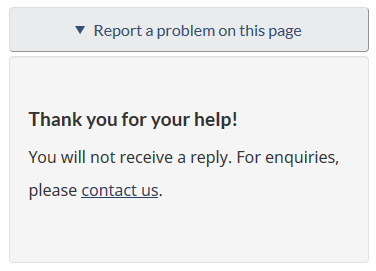

See [https://www.w3.org/WAI/WCAG21/Techniques/aria/ARIA22](https://www.w3.org/WAI/WCAG21/Techniques/aria/ARIA22)
