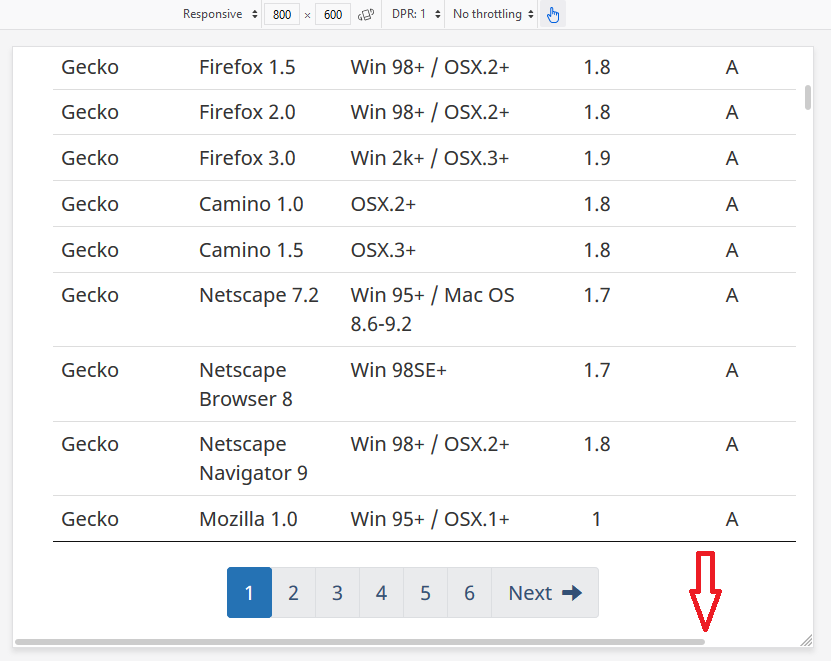
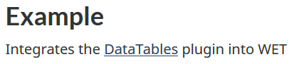
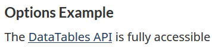
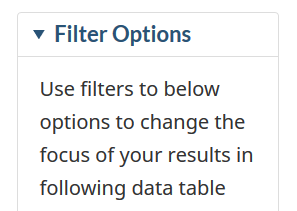
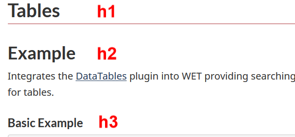

**Disclaimer:** This document is a short, follow up review. Its main purpose is to raise awareness for education and training purposes. This document is also meant to help to bring the product to be fully Web Accessible for all users including people with disabilities.

## Scope of review
**Reviewed on October 7, 2019**

**General notes:**

* Common elements in the header and footer were not tested

* The page was last updated in 2014, needs a revisit

* Suggested codes for tables can be improved.

There is overreliance on Aria, there are unnecessarily used role attributes (such as ```<tr role=”row”>```), rowspan/colspan attributes (such as <colspan="1">).

Sample th code:

```html
<th class="sorting" tabindex="0" aria-controls="wb-auto-4" rowspan="1" colspan="1" style="width: 227px;" aria-label="Rendering engine: activate for ascending sort">
Rendering engine
<span class="sorting-cnt"><span class="sorting-icons"></span></span>
</th>
```

**Notes:**

1.	All comments in the document refer to English and French pages unless specified otherwise. 

2.	Testing done using: Firefox 67, NVDA, keyboard-only

3.	Pages were tested against WCAG 2.1 level A, AA. (only fixes for WCAG 2.0 AA are strictly required at present)


## Table of Contents

* Short review of https://wet-boew.github.io/themes-dist/GCWeb/demos/tables/tables-en.html on its accessibility and usability for people with disabilities

* [Scope of review](#user-content-scope-of-review)

* [Table of Contents](#user-content-table-of-contents)

* [WCAG 2.1 accessibility issues levels A, AA and AAA](#user-content-wcag-21-accessibility-issues-levels-a-aa-and-aaa)
    * 1.1 Text Alternatives
    * 1.2 Time-based Media
    * 1.3 Adaptable
    * 1.4 Distinguishable
    * 2.1 Keyboard Accessible
    * 2.2 Enough Time
    * 2.3 Seizures
    * 2.4 Navigable
    * 2.5 Input Modalities 
    * 3.1 Readable
    * 3.2 Predictable
    * 3.3 Input Assistance
    * 4.1 Compatible

## WCAG 2.1 accessibility issues levels A, AA and AAA
### 1.1 Text Alternatives

### 1.2 Time-based Media

### 1.3 Adaptable
[1.3.1: Info and Relationships](https://www.w3.org/WAI/WCAG21/Understanding/info-and-relationships.html)

There are 4 tables and none of their cells is associated with headers, either by using “scope” attribute or by “headers” and “ID”s.

[F91: Failure of Success Criterion 1.3.1 for not correctly marking up table headers]
(https://www.w3.org/WAI/WCAG21/Techniques/failures/F91.html)

### 1.4 Distinguishable
[1.4.10 Reflow (WCAG 2.1 Level AA)](https://www.w3.org/WAI/WCAG21/Understanding/reflow)

Although the design is somewhat responsive, horizontal scroll bar appears on screens smaller than 1200px.



### 2.1 Keyboard Accessible
[2.1.4 Character Key Shortcuts (WCAG 2.1 Level A)](https://www.w3.org/WAI/WCAG21/Understanding/character-key-shortcuts)

Not tested

### 2.2 Enough Time
### 2.3 Seizures
### 2.4 Navigable
[2.4.2 Page Titled (Level A)](https://www.w3.org/WAI/WCAG21/Understanding/page-titled)

A debatable issue: The title is almost the same as the h1. Should Titles and h1s not be different? h1 could have been more descriptive.

```<title>Tables - Canada.ca</title>```

```<h1 property="name" id="wb-cont">Tables</h1>```

[2.4.4 Link Purpose (In Context) Level A](https://www.w3.org/WAI/WCAG21/Understanding/link-purpose-in-context.html)

First hyperlink was provided as below



whereas the next similar one is provided as below:



The first one would have been more meaningful, if the word “plugin” were included in the hyperlink text.

[2.4.6 Headings and Labels Level AA](https://www.w3.org/WAI/WCAG21/Understanding/headings-and-labels.html)

* Improper usage of h4s, both semantically and as mark-up.
The code below does nothing.

```<h4 class="wb-inv">Filtering Options</h4>```

The code below is sufficient and is read by the screen reader. But what does h4 class="h4" do and should there be any headings in summary elements?

```<summary><h4 class="h4">Filter Options</h4></summary> ```



* May not be considered as an important error, but the h2 heading seen below is not actually serving as a meaningful heading for any section.



The existing h1 could be more descriptive, h2 can be removed along with its text, all h3s on the webpage could become h2s, and all h4s as mark-up can be removed as well.

### 2.5 Input Modalities
[2.5.4 Motion Actuation (WCAG 2.1 Level A)](https://www.w3.org/WAI/WCAG21/Understanding/motion-actuation)

NOT tested

### 3.1 Readable
### 3.2 Predictable
### 3.3 Input Assistance
### 4.1 Compatible
