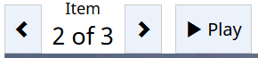
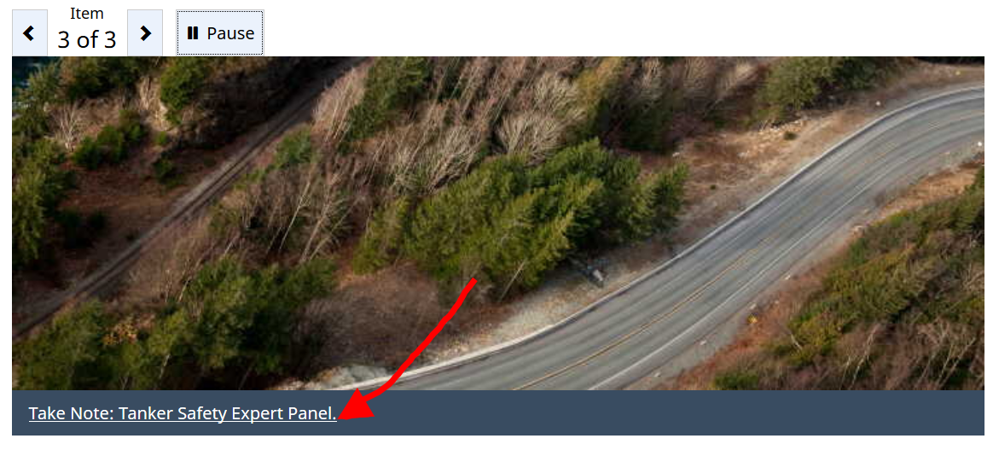
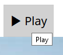
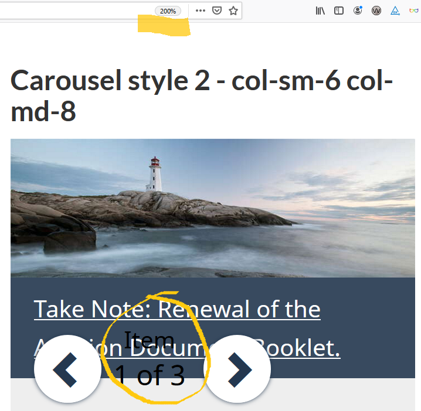
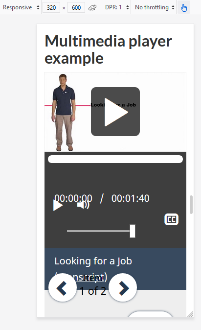

**Disclaimer:** This document is a short, follow up review. Its main purpose is to raise awareness for education and training purposes. This document is also meant to help to bring the product to be fully Web Accessible for all users including people with disabilities.

## Scope of review
**Reviewed on October 18, 2019**

**General notes:**

The codes provided in this page are not publisher-friendly and there are incorrect practices. **A redesign might be beneficial**.

* Most importantly, the codes provided as examples for Carousel styles, are not helpful, not “working examples” at all

“Dot dot dots” in codes are interpreted differently by different people and they are not informative. Actual code could have been used instead.

Please consider these user controls:



This is the example code provided for that portion:

```html
<ul role="tablist">
	<li class="active"><a href="#panel1">Tab 1: ...</a></li>
	<li><a href="#panel2">Tab 2: ...</a></li>
	...
</ul>
```

Below is the actual code block that renders the same portion:

```html
<ul role="tablist" aria-live="off">
<li class="control prv"><a class="prv" href="javascript:;" role="button" title="Previous"><span class="glyphicon glyphicon-chevron-left"></span><span class="wb-inv">Previous</span></a></li> <li class="control  tab-count" tabindex="0"><div>Item <div class="curr-count"><span class="curr-index">1</span> of 3</div></div></li><li class="control nxt"><a class="nxt" href="javascript:;" role="button" title="Next"><span class="glyphicon glyphicon-chevron-right"></span><span class="wb-inv">Next</span></a></li> 
<li class="active" role="presentation"><a href="#panel1" tabindex="0" role="tab" aria-selected="true" aria-controls="panel1" id="panel1-lnk">Tab 1: Take Note: Renewal of the Aviation Document Booklet.</a></li>
<li class="" role="presentation"><a href="#panel2" tabindex="-1" role="tab" aria-selected="false" aria-controls="panel2" id="panel2-lnk">Tab 2: Take Note: Grade Crossing Improvement Program (GCIP).</a></li>
<li role="presentation"><a href="#panel3" tabindex="-1" role="tab" aria-selected="false" aria-controls="panel3" id="panel3-lnk">Tab 3: Take Note: Tanker Safety Expert Panel.</a></li>
<li class="control plypause"><a class="plypause" href="javascript:;" role="button" title="Play"><span class="glyphicon glyphicon-play"></span> <span>Play</span><span class="wb-inv">  -  Start tab rotation</span></a></li>
</ul>
```

* Insertion of a p element (as copied and pasted from the web page below) should not be recommended inside fiigcaption elements. A caption is not a paragraph. Canada.ca is not adding p’s in figcaptions but there are departments adding them, thinking that is how it should be, just because of this template.

```html
<figcaption>
<p>
	...
</p>
</figcaption>
```

Here is how an example figcaption should be constructed:

```html
<figure>
    
    <figcaption>An elephant at sunset</figcaption>
</figure>
```

(Source: [https://developer.mozilla.org/en-US/docs/Web/HTML/Element/figcaption](https://developer.mozilla.org/en-US/docs/Web/HTML/Element/figcaption))

Here is the example from Canada.ca’s front page, copied on October 18, 2019:

```html
<figure class="well well-sm brdr-rds-0 eqht-trgt" style="vertical-align: top; min-height: 394px;">
	
	<figcaption class="h5">Early Learning and Child Care</figcaption>
	<p>The new Expert Panel will provide a better understanding of the early learning and child care landscape in Canada.</p>
</figure>
```

* The originals of the images used as examples, have smaller sizes than their displayed sizes. Therefore, their quality is poor. (Artifact) Poor quality images in websites is an important UX issue, an example page cannot be based on bad practices.

The size of the original image is 730X250 pixels


[https://wet-boew.github.io/themes-dist/GCWeb/demos/tabs/img/protect-environment.jpg](https://wet-boew.github.io/themes-dist/GCWeb/demos/tabs/img/protect-environment.jpg)

This is its 730X250 pixels portion displayed on a 1920X1080 monitor:


* The 3 figcaption examples used for all pictures are confusing, they give the impression that figcaptions should always start with “Take note:” and one might think any image goes for any topic

* In figcaptions’ existing usages in Canada.ca, there are no periods at their endings



* Tooltips are used to show what is already provided as text



The tooltip here could have been “start the slide show”, for example.
 
**Notes:**

1.	All comments in the document refer to English and French pages unless specified otherwise. 

2.	Testing done using: Firefox 67, NVDA, keyboard-only

3.	Pages were tested against WCAG 2.1 level A, AA. (only fixes for WCAG 2.0 AA are strictly required at present)


## Table of Contents

* Short review of https://wet-boew.github.io/themes-dist/GCWeb/demos/tabs/tabs-carousel-en.html on its accessibility and usability for people with disabilities

* [Scope of review](#user-content-scope-of-review)

* [Table of Contents](#user-content-table-of-contents)

* [WCAG 2.1 accessibility issues levels A, AA and AAA](#user-content-wcag-21-accessibility-issues-levels-a-aa-and-aaa)
    * 1.1 Text Alternatives
    * 1.2 Time-based Media
    * 1.3 Adaptable
    * 1.4 Distinguishable
    * 2.1 Keyboard Accessible
    * 2.2 Enough Time
    * 2.3 Seizures
    * 2.4 Navigable
    * 2.5 Input Modalities 
    * 3.1 Readable
    * 3.2 Predictable
    * 3.3 Input Assistance
    * 4.1 Compatible

## WCAG 2.1 accessibility issues levels A, AA and AAA
### 1.1 Text Alternatives

### 1.2 Time-based Media

### 1.3 Adaptable

### 1.4 Distinguishable
[1.4.4 Resize text - Level AA](https://www.w3.org/WAI/WCAG21/Understanding/resize-text.html)

Some examples break when text is resized.



[1.4.10 Reflow - Level AA](https://www.w3.org/WAI/WCAG21/Understanding/reflow.html)

Many examples’ layouts break at very small screens, threshold seems to be 340px.



### 2.1 Keyboard Accessible
[2.1.4 Character Key Shortcuts (WCAG 2.1 Level A)](https://www.w3.org/WAI/WCAG21/Understanding/character-key-shortcuts)

Not tested

### 2.2 Enough Time
### 2.3 Seizures
### 2.4 Navigable
[2.4.3 Focus Order - Level A](https://www.w3.org/WAI/WCAG21/Understanding/focus-order.html)


In this second example, though the user controls are placed after the image, their order in the DOM is before the image. Consequently, the controls receive focus before the image does.

There are other examples with incorrect focus order.

### 2.5 Input Modalities
[2.5.4 Motion Actuation (WCAG 2.1 Level A)](https://www.w3.org/WAI/WCAG21/Understanding/motion-actuation)

NOT tested

### 3.1 Readable
### 3.2 Predictable
### 3.3 Input Assistance
### 4.1 Compatible
