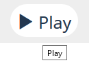
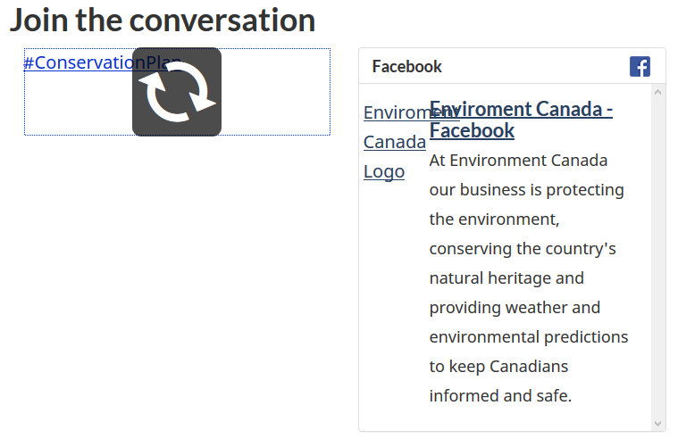
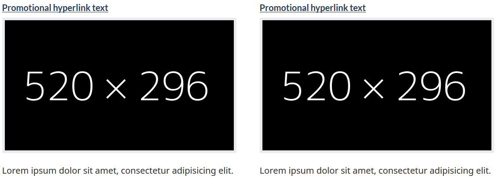
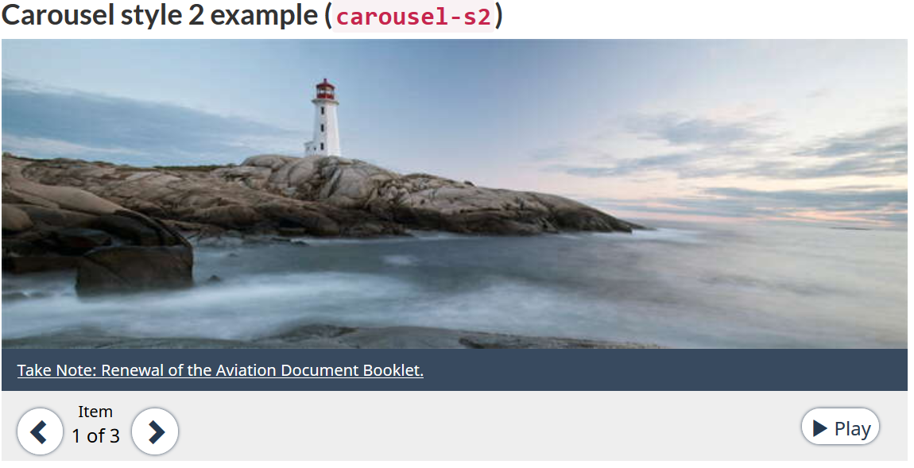

**Disclaimer:** This document is a short, follow up review. Its main purpose is to raise awareness for education and training purposes. This document is also meant to help to bring the product to be fully Web Accessible for all users including people with disabilities.

## Scope of review
**Reviewed on October 31, 2019**

**General notes:**

* Insertion of a p element (as copied and pasted from the web page below) should not be recommended inside figcaption elements. A caption is not a paragraph. Canada.ca is not adding p’s in figcaptions but there are departments adding them, thinking that is how it should be, just because of these templates.

```html
<figure>

<figcaption>
<p>Banff National Park </p>
</figcaption>
</figure>
```

Here is how an example figcaption should be constructed:

```html
<figure>
    
    <figcaption>An elephant at sunset</figcaption>
</figure>
```

(Source: [https://developer.mozilla.org/en-US/docs/Web/HTML/Element/figcaption](https://developer.mozilla.org/en-US/docs/Web/HTML/Element/figcaption))

Here is the example from Canada.ca’s front page, copied on October 18, 2019:

```html
<figure class="well well-sm brdr-rds-0 eqht-trgt" style="vertical-align: top; min-height: 394px;">
	
	<figcaption class="h5">Early Learning and Child Care</figcaption>
	<p>The new Expert Panel will provide a better understanding of the early learning and child care landscape in Canada.</p>
</figure>
```

* Tooltips are used to show what is already provided as text



The tooltip here could have been “start the slide show”, for example.

* Page has broken parts



**Notes:**

1.	All comments in the document refer to English and French pages unless specified otherwise. 

2.	Testing done using: Firefox 67, NVDA, keyboard-only

3.	Pages were tested against WCAG 2.1 level A, AA. (only fixes for WCAG 2.0 AA are strictly required at present)


## Table of Contents

* Short review of https://wet-boew.github.io/themes-dist/GCWeb/event-en.html on its accessibility and usability for people with disabilities

* [Scope of review](#user-content-scope-of-review)

* [Table of Contents](#user-content-table-of-contents)

* [WCAG 2.1 accessibility issues levels A, AA and AAA](#user-content-wcag-21-accessibility-issues-levels-a-aa-and-aaa)
    * 1.1 Text Alternatives
    * 1.2 Time-based Media
    * 1.3 Adaptable
    * 1.4 Distinguishable
    * 2.1 Keyboard Accessible
    * 2.2 Enough Time
    * 2.3 Seizures
    * 2.4 Navigable
    * 2.5 Input Modalities 
    * 3.1 Readable
    * 3.2 Predictable
    * 3.3 Input Assistance
    * 4.1 Compatible

## WCAG 2.1 accessibility issues levels A, AA and AAA
### 1.1 Text Alternatives
[1.1.1 Non-text Content - Level A](https://www.w3.org/WAI/WCAG21/Understanding/non-text-content.html)



The images used as examples throughout the page, such as the ones displayed above, are not decorative but they are all marked-up as decorative using alt=””. The text inside them provides necessary information about the image sizes and there is no information about the image sizes provided elsewhere.

### 1.2 Time-based Media

### 1.3 Adaptable

### 1.4 Distinguishable
[1.4.4 Resize text - Level AA](https://www.w3.org/WAI/WCAG21/Understanding/resize-text.html)

Some examples break when text is resized.


[1.4.10 Reflow (WCAG 2.1 Level AA)](https://www.w3.org/WAI/WCAG21/Understanding/reflow)

Many examples’ layouts break at very small screens, threshold seems to be 340px.


### 2.1 Keyboard Accessible
[2.1.4 Character Key Shortcuts (WCAG 2.1 Level A)](https://www.w3.org/WAI/WCAG21/Understanding/character-key-shortcuts)

Not tested

### 2.2 Enough Time
### 2.3 Seizures
### 2.4 Navigable
[2.4.1 Bypass Blocks - Level A](https://www.w3.org/WAI/WCAG21/Understanding/bypass-blocks.html)


The link provided to bypass blocks does nothing for the reason that its target ID wb-cont does not exist in any element in the page.

[2.4.3 Focus Order - Level A](https://www.w3.org/WAI/WCAG21/Understanding/focus-order.html)



In this second example, though the user controls are placed after the image, their order in the DOM is before the image. Consequently, the controls receive focus before the image does.

There are other examples with incorrect focus order.

### 2.5 Input Modalities
[2.5.4 Motion Actuation (WCAG 2.1 Level A)](https://www.w3.org/WAI/WCAG21/Understanding/motion-actuation)

NOT tested

### 3.1 Readable
### 3.2 Predictable
### 3.3 Input Assistance
### 4.1 Compatible
