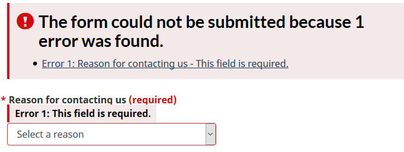

# Short review of [https://wet-boew.github.io/themes-dist/GCWeb/feedback-en.html](https://wet-boew.github.io/themes-dist/GCWeb/feedback-en.html) on its accessibility and usability for people with disabilities

**Disclaimer:** This document is a short, follow up review. Its main purpose is to raise awareness for education and training purposes. This document is also meant to help to bring the product to be fully Web Accessible for all users including people with disabilities.

## Scope of review
**Reviewed on October 8, 2019**

**General notes:**

* Common elements in the header and footer were not tested

* The page was last updated in 2014, needs a revisit

* There are tens of open issues about forms on GitHub, citing over-zealous validations that are activated even before one single character is typed or duplicate usages of the word “required”. Forms need a redesign.

* The same [*Privacy Act*](https://laws-lois.justice.gc.ca/eng/acts/P-21/index.html) link has been provided twice, in a close proximity to each other

* No mention of language that repeats the page language is needed

```<input type="hidden" name="language" value="en">```


**Notes:**

1.	All comments in the document refer to English and French pages unless specified otherwise. 

2.	Testing done using: Firefox 67, NVDA, keyboard-only

3.	Pages were tested against WCAG 2.1 level A, AA. (only fixes for WCAG 2.0 AA are strictly required at present)


## Table of Contents

* Short review of https://wet-boew.github.io/themes-dist/GCWeb/feedback-en.html on its accessibility and usability for people with disabilities

* [Scope of review](#user-content-scope-of-review)

* [Table of Contents](#user-content-table-of-contents)

* [WCAG 2.1 accessibility issues levels A, AA and AAA](#user-content-wcag-21-accessibility-issues-levels-a-aa-and-aaa)
    * 1.1 Text Alternatives
    * 1.2 Time-based Media
    * 1.3 Adaptable
    * 1.4 Distinguishable
    * 2.1 Keyboard Accessible
    * 2.2 Enough Time
    * 2.3 Seizures
    * 2.4 Navigable
    * 2.5 Input Modalities 
    * 3.1 Readable
    * 3.2 Predictable
    * 3.3 Input Assistance
    * 4.1 Compatible

## WCAG 2.1 accessibility issues levels A, AA and AAA
### 1.1 Text Alternatives

### 1.2 Time-based Media

### 1.3 Adaptable

### 1.4 Distinguishable
[1.4.13 Content on Hover or Focus (WCAG 2.1 Level AA)](https://www.w3.org/WAI/WCAG21/Understanding/content-on-hover-or-focus.html)

Once the focus is removed from any required field without entering any data, additional content is triggered.

For example, if a keyboard user first wants to enter the message and then wants to choose the reason for contacting, there is no way to do it without seeing the screenshot below. This discussion dominates the issues about forms on GitHub and there is an agreement on the approach that validations should not be performed before the submit button is hit.



### 2.1 Keyboard Accessible
[2.1.4 Character Key Shortcuts (WCAG 2.1 Level A)](https://www.w3.org/WAI/WCAG21/Understanding/character-key-shortcuts)

Not tested

### 2.2 Enough Time
### 2.3 Seizures
### 2.4 Navigable
[2.4.2 Page Titled (Level A)](https://www.w3.org/WAI/WCAG21/Understanding/page-titled)

A debatable issue: The title is almost the same as the h1. Should Titles and h1s not be different? h1 could have been more descriptive.

```<title> Feedback form - Canada.ca</title>```

```<h1 property="name" id="wb-cont">Feedback form</h1>```

### 2.5 Input Modalities
[2.5.4 Motion Actuation (WCAG 2.1 Level A)](https://www.w3.org/WAI/WCAG21/Understanding/motion-actuation)

NOT tested

### 3.1 Readable
### 3.2 Predictable
[3.2.1 On Focus (Level A)](https://www.w3.org/WAI/WCAG21/Understanding/on-focus.html)

Please see 1.4.13

### 3.3 Input Assistance
### 4.1 Compatible
