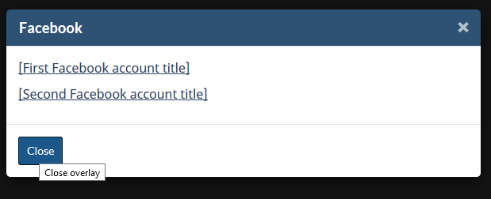
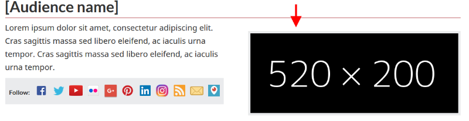

**Disclaimer:** This document is a short, follow up review. Its main purpose is to raise awareness for education and training purposes. This document is also meant to help to bring the product to be fully Web Accessible for all users including people with disabilities.

## Scope of review
**Reviewed on October 29, 2019**

**General notes:**


Social media icons: are all of them really necessary?

* G+ does not exist anymore

* Despite there is none for the icons, tooltips appear on screens that open after clicking icons:



 * The tooltip that is intended for the sighted users is redundant in this case

 * And the yellow-highlighted span contains words intended for screen readers says what is already evident.

 Consequently, what the screen reader reads, is this: “Close close overlay”

```html    
<button type="button" class="btn btn-sm btn-primary pull-left popup-modal-dismiss" title="Close overlay">
    Close
<span class="wb-inv">Close overlay</span>
</button>
```

**Notes:**

1.	All comments in the document refer to English and French pages unless specified otherwise. 

2.	Testing done using: Firefox 67, NVDA, keyboard-only

3.	Pages were tested against WCAG 2.1 level A, AA. (only fixes for WCAG 2.0 AA are strictly required at present)


## Table of Contents

* Short review of https://wet-boew.github.io/themes-dist/GCWeb/gc-audience-en.html on its accessibility and usability for people with disabilities

* [Scope of review](#user-content-scope-of-review)

* [Table of Contents](#user-content-table-of-contents)

* [WCAG 2.1 accessibility issues levels A, AA and AAA](#user-content-wcag-21-accessibility-issues-levels-a-aa-and-aaa)
    * 1.1 Text Alternatives
    * 1.2 Time-based Media
    * 1.3 Adaptable
    * 1.4 Distinguishable
    * 2.1 Keyboard Accessible
    * 2.2 Enough Time
    * 2.3 Seizures
    * 2.4 Navigable
    * 2.5 Input Modalities 
    * 3.1 Readable
    * 3.2 Predictable
    * 3.3 Input Assistance
    * 4.1 Compatible

## WCAG 2.1 accessibility issues levels A, AA and AAA
### 1.1 Text Alternatives
[1.1.1 Non-text Content - Level A](https://www.w3.org/WAI/WCAG21/Understanding/non-text-content.html)

Picture placeholders (indicated by red arrow) are marked as decorative by using alt=”” and the important information pertaining to their sizes is not provided elsewhere. There are 4 of them.



In the actual pages, such pictures are not decorative as well. 

In this case, an alt text saying the size of the picture and what that placeholder is for, might be more meaningful.

### 1.2 Time-based Media

### 1.3 Adaptable
[1.3.3 Sensory Characteristics - Level A](https://www.w3.org/WAI/WCAG21/Understanding/sensory-characteristics.html)

The following social media icons are read by screen readers but they have no tooltips for the sighted users.


[F26: Failure of Success Criterion 1.3.3 due to using a graphical symbol alone to convey information](https://www.w3.org/WAI/WCAG21/Techniques/failures/F26.html)

### 1.4 Distinguishable

### 2.1 Keyboard Accessible
[2.1.4 Character Key Shortcuts (WCAG 2.1 Level A)](https://www.w3.org/WAI/WCAG21/Understanding/character-key-shortcuts)

Not tested

### 2.2 Enough Time
### 2.3 Seizures
### 2.4 Navigable
[2.4.2 Page Titled (Level A)](https://www.w3.org/WAI/WCAG21/Understanding/page-titled)

A debatable issue: The title is almost the same as the h1. Should Titles and h1s not be different? h1 could have been more descriptive.

### 2.5 Input Modalities
[2.5.4 Motion Actuation (WCAG 2.1 Level A)](https://www.w3.org/WAI/WCAG21/Understanding/motion-actuation)

NOT tested

### 3.1 Readable
### 3.2 Predictable
### 3.3 Input Assistance
### 4.1 Compatible
