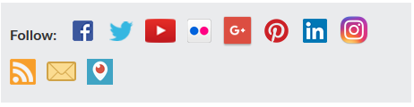

# Short review of [https://wet-boew.github.io/themes-dist/GCWeb/institution-contact-en.html](https://wet-boew.github.io/themes-dist/GCWeb/institution-contact-en.html) on its accessibility and usability for people with disabilities

**Disclaimer:** This document is a short, follow up review. Its main purpose is to raise awareness for education and training purposes. This document is also meant to help to bring the product to be fully Web Accessible for all users including people with disabilities.

## Scope of review
**Reviewed on October 8, 2019**

**General notes:**
* Revision of social media links might help

    * 

    * Google+ does not exist anymore

    * The instruction “follow” is not relevant to all of them, for example email

    * Could not see these links in any of the existing contact pages of departments

    * “Skip to main content” link does not skip these

* Page layout as a template, is not consistent with the existing about pages

**Notes:**

1.	All comments in the document refer to English and French pages unless specified otherwise. 

2.	Testing done using: Firefox 67, NVDA, keyboard-only

3.	Pages were tested against WCAG 2.1 level A, AA. (only fixes for WCAG 2.0 AA are strictly required at present)


## Table of Contents

* Short review of https://wet-boew.github.io/themes-dist/GCWeb/institution-contact-en.html on its accessibility and usability for people with disabilities

* [Scope of review](#user-content-scope-of-review)

* [Table of Contents](#user-content-table-of-contents)

* [WCAG 2.1 accessibility issues levels A, AA and AAA](#user-content-wcag-21-accessibility-issues-levels-a-aa-and-aaa)
    * 1.1 Text Alternatives
    * 1.2 Time-based Media
    * 1.3 Adaptable
    * 1.4 Distinguishable
    * 2.1 Keyboard Accessible
    * 2.2 Enough Time
    * 2.3 Seizures
    * 2.4 Navigable
    * 2.5 Input Modalities 
    * 3.1 Readable
    * 3.2 Predictable
    * 3.3 Input Assistance
    * 4.1 Compatible

## WCAG 2.1 accessibility issues levels A, AA and AAA
### 1.1 Text Alternatives
### 1.2 Time-based Media
### 1.3 Adaptable
[1.3.3 Sensory Characteristics - Level A](https://www.w3.org/WAI/WCAG21/Understanding/sensory-characteristics.html)


The social media icons shown above have no tooltips or labels. Screenreaders read them, but sighted people will have to know which symbol relates to what, in order to use them.

### 1.4 Distinguishable
### 2.1 Keyboard Accessible
[2.1.4 Character Key Shortcuts (WCAG 2.1 Level A)](https://www.w3.org/WAI/WCAG21/Understanding/character-key-shortcuts)

Not tested

### 2.2 Enough Time
### 2.3 Seizures
### 2.4 Navigable
[2.4.2 Page Titled (Level A)](https://www.w3.org/WAI/WCAG21/Understanding/page-titled)

A debatable issue: The title is almost the same as the h1. Should Titles and h1s not be different? h1 could have been more descriptive.

```html
<title>Contact [Institution name] - Canada.ca</title>
<h1 property="name" id="wb-cont">Contact [Institution name]</h1>
```

### 2.5 Input Modalities
[2.5.4 Motion Actuation (WCAG 2.1 Level A)](https://www.w3.org/WAI/WCAG21/Understanding/motion-actuation)

NOT tested

### 3.1 Readable
### 3.2 Predictable
### 3.3 Input Assistance
### 4.1 Compatible
