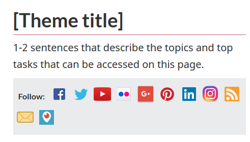
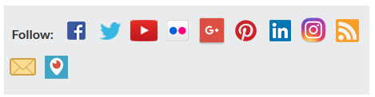
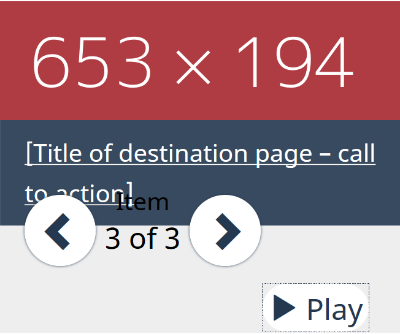
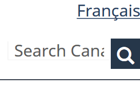
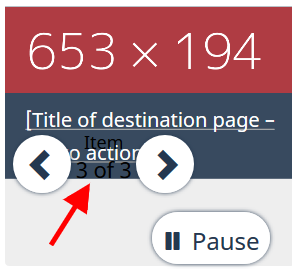

**Disclaimer:** This document is a short, follow up review. Its main purpose is to raise awareness for education and training purposes. This document is also meant to help to bring the product to be fully Web Accessible for all users including people with disabilities.

## Scope of review
**Reviewed on July 16, 2019**


**Notes:**

1.	All comments in the document refer to English and French pages unless specified otherwise. 

2.	Testing done using: Firefox 67, NVDA, keyboard-only

3.	Pages were tested against WCAG 2.1 level A, AA. (only fixes for WCAG 2.0 AA are strictly required at present)


## Table of Contents

* Short review of https://wet-boew.github.io/themes-dist/GCWeb/theme-en.html on its accessibility and usability for people with disabilities

* [Scope of review](#user-content-scope-of-review)

* [Table of Contents](#user-content-table-of-contents)

* [WCAG 2.1 accessibility issues levels A, AA and AAA](#user-content-wcag-21-accessibility-issues-levels-a-aa-and-aaa)
    * 1.1 Text Alternatives
    * 1.2 Time-based Media
    * 1.3 Adaptable
    * 1.4 Distinguishable
    * 2.1 Keyboard Accessible
    * 2.2 Enough Time
    * 2.3 Seizures
    * 2.4 Navigable
    * 2.5 Input Modalities 
    * 3.1 Readable
    * 3.2 Predictable
    * 3.3 Input Assistance
    * 4.1 Compatible

## WCAG 2.1 accessibility issues levels A, AA and AAA
### 1.1 Text Alternatives
### 1.2 Time-based Media
### 1.3 Adaptable
[1.3.2 Meaningful Sequence (Level A)](https://www.w3.org/WAI/WCAG21/Understanding/meaningful-sequence)

1.	Tab order: Starts from the menu on the right (Most requested), goes to content (Services and information), then goes to right again (More information for)

* [F1: Failure of Success Criterion 1.3.2 due to changing the meaning of content by positioning information with CSS](https://www.w3.org/WAI/WCAG21/Techniques/failures/F1.html)

2.	Within the carousel: The tab order of “Title of destination page – call to action” link comes after the user controls (Right-left arrows, item x of x, pause)

3.	Is presenting social media icons right after h1 a good idea?



[1.3.3 Sensory Characteristics - Level A](https://www.w3.org/WAI/WCAG21/Understanding/sensory-characteristics.html)

Social media icons, which are read to screen readers, do not have tooltips. The design assumes that the users know what all these logos stand for.



### 1.4 Distinguishable
[1.4.4 Resize text (Level AA)](https://www.w3.org/WAI/WCAG21/Understanding/resize-text)

On 200% resize, the carousel has issues.



* [F69: Failure of Success Criterion 1.4.4 when resizing visually rendered text up to 200 percent causes the text, image or controls to be clipped, truncated or obscured](https://www.w3.org/WAI/WCAG21/Techniques/failures/F69.html)

On smaller screens, 200% resize breaks the placeholder of the search field.



[1.4.10 Reflow (WCAG 2.1 Level AA)](https://www.w3.org/WAI/WCAG21/Understanding/reflow)

On small screens, content of carousel is dislocated. (Please see 1.4.4 as well.) The text that reads “Item 3 of 3”, as indicated by red arrow, is not perceivable.



### 2.1 Keyboard Accessible
[2.1.1 Keyboard (Level A)](https://www.w3.org/WAI/WCAG21/Understanding/keyboard)

[2.1.2 No Keyboard Trap (Level A)](https://www.w3.org/WAI/WCAG21/Understanding/no-keyboard-trap)

[2.1.4 Character Key Shortcuts (WCAG 2.1 Level A)](https://www.w3.org/WAI/WCAG21/Understanding/character-key-shortcuts)

Not tested

### 2.2 Enough Time
### 2.3 Seizures
### 2.4 Navigable
[2.4.2 Page Titled (Level A)](https://www.w3.org/WAI/WCAG21/Understanding/page-titled)

A debatable issue: The placeholder title used is almost the same as the h1. Should Titles and h1s not be different?

```html
<title>[Theme title] - Canada.ca</title>
<h1 property="name" id="wb-cont">[Theme title]</h1>
```

### 2.5 Input Modalities
[2.5.4 Motion Actuation (WCAG 2.1 Level A)](https://www.w3.org/WAI/WCAG21/Understanding/motion-actuation)

NOT tested

### 3.1 Readable
### 3.2 Predictable
### 3.3 Input Assistance
### 4.1 Compatible
