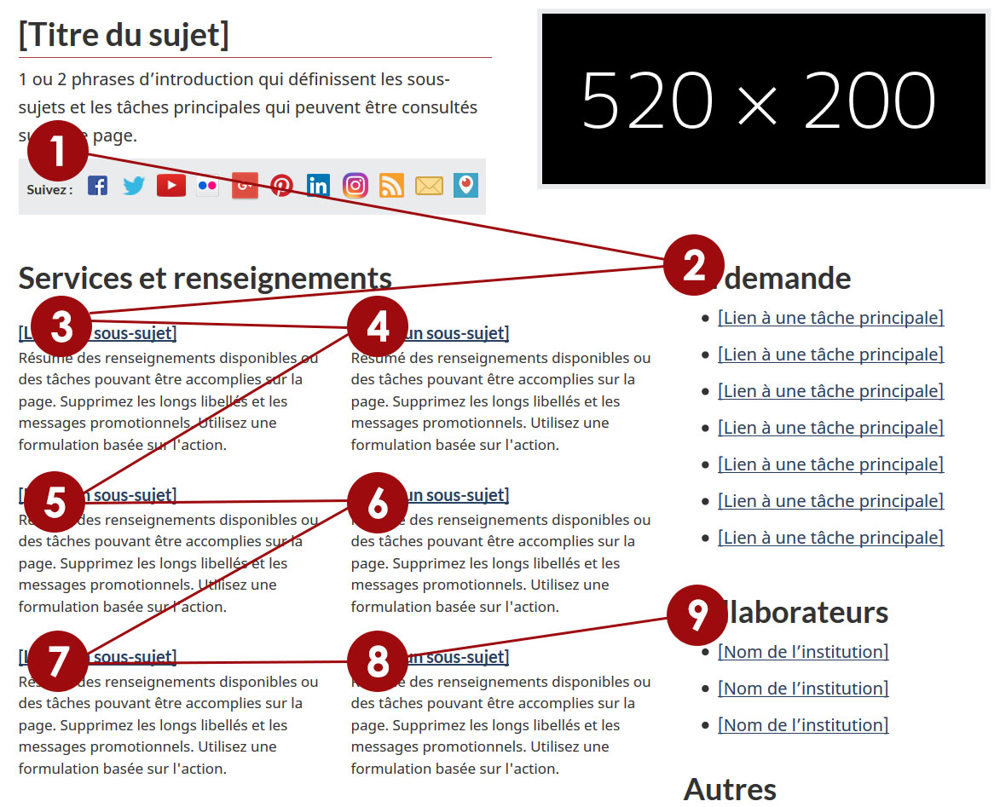

**Disclaimer:** This document is a short, follow up review. Its main purpose is to raise awareness for education and training purposes. This document is also meant to help to bring the product to be fully accessible for all users including people with disabilities.

**Note:** AAACT at SSC is assessing this product solely for informational purposes. Please note that this assessment does not constitute a representation that this product meets the needs of the Government of Canada, or a commitment on the part of the Government of Canada to purchase any such products.

## Scope of review
**Reviewed on REVIEWDATE**

The AAACT Program tested NUMPAGES pages of this application. They are listed below: 

Page 1: English – [https://wet-boew.github.io/themes-dist/GCWeb/topic-en.html](https://wet-boew.github.io/themes-dist/GCWeb/topic-en.html) 

Page 1: French – [https://wet-boew.github.io/themes-dist/GCWeb/topic-fr.html](https://wet-boew.github.io/themes-dist/GCWeb/topic-fr.html)

**Notes:**

1.	All comments in the document refer to English and French pages unless specified otherwise. 

2.	Testing done using: Firefox 67, NVDA, keyboard-only

3.	Pages were tested against WCAG 2.1 level A, AA. (only fixes for WCAG 2.0 AA are strictly required at present)

## Table of Contents

* Short review of Web Experience Toolkit on its accessibility and usability for people with disabilities

* [Scope of review](#user-content-scope-of-review)

* [Table of Contents](#user-content-table-of-contents)

* [WCAG 2.1 accessibility issues levels A, AA and AAA](#user-content-wcag-21-accessibility-issues-levels-a-aa-and-aaa)
    * 1.1 Text Alternatives
    * 1.2 Time-based Media
    * 1.3 Adaptable
    * 1.4 Distinguishable
    * 2.1 Keyboard Accessible
    * 2.2 Enough Time
    * 2.3 Seizures
    * 2.4 Navigable
    * 2.5 Input Modalities 
    * 3.1 Readable
    * 3.2 Predictable
    * 3.3 Input Assistance
    * 4.1 Compatible

## WCAG 2.1 accessibility issues levels A, AA and AAA
### 1.1 Text Alternatives
[1.1.1 Non-text content (Level A)](https://www.w3.org/WAI/WCAG21/Understanding/non-text-content)

1.	Pass

**Note:** The 520 x 200 image technically fails because the alt attribute is empty.

### 1.2 Time-based Media
[1.2.1 Audio-only and Video-only (prerecorded) (Level A)](https://www.w3.org/WAI/WCAG21/Understanding/audio-only-and-video-only-prerecorded)

1. n/a

[1.2.2 Captions (prerecorded) (Level A)](https://www.w3.org/WAI/WCAG21/Understanding/captions-prerecorded)

1. n/a

[1.2.3 Audio Description or Media Alternative (prerecorded) (Level A)](https://www.w3.org/WAI/WCAG21/Understanding/audio-description-prerecorded)

1. n/a

[1.2.4 Captions (Live) (Level AA)](https://www.w3.org/WAI/WCAG21/Understanding/captions-live)

1. n/a

[1.2.5 Audio Description (prerecorded) (Level AA)](https://www.w3.org/WAI/WCAG21/Understanding/audio-description-prerecorded)

1. n/a

### 1.3 Adaptable
[1.3.1 Info and Relationships (Level A)](https://www.w3.org/WAI/WCAG21/Understanding/info-and-relationships)

1.	<mark>Checking with Michel for whether invisible modals show up in Jaws heading lists</mark>

[1.3.2 Meaningful Sequence (Level A)](https://www.w3.org/WAI/WCAG21/Understanding/meaningful-sequence)

1.	“Most requested” is coded before “Services and Information” despite opposite visual order. See 2.4.3 Focus order.

[1.3.3 Sensory Characteristics - Level A](https://www.w3.org/WAI/WCAG21/Understanding/sensory-characteristics.html)

1. 

[1.3.4 Orientation (WCAG 2.1 Level AA)](https://www.w3.org/WAI/WCAG21/Understanding/orientation)

1.	Pass

[1.3.5 Identify Input Purpose (WCAG 2.1 Level AA)](https://www.w3.org/WAI/WCAG21/Understanding/identify-input-purpose)

1.	Pass

### 1.4 Distinguishable
[1.4.1 Use of Color (Level A)](https://www.w3.org/WAI/WCAG21/Understanding/use-of-color)

1.	pass

[1.4.2 Audio Control (Level A)](https://www.w3.org/WAI/WCAG21/Understanding/audio-control)

1.	N/a

[1.4.3 Contrast (Minimum) (Level AA)](https://www.w3.org/WAI/WCAG21/Understanding/contrast-minimum)

1.	pass

[1.4.4 Resize text (Level AA)](https://www.w3.org/WAI/WCAG21/Understanding/resize-text)

1.	Pass

[1.4.5 Images of Text (Level AA)](https://www.w3.org/WAI/WCAG21/Understanding/images-of-text)

1.	pass

[1.4.10 Reflow (WCAG 2.1 Level AA)](https://www.w3.org/WAI/WCAG21/Understanding/reflow)

1.	Pass

[1.4.11 Non-Text Contrast (WCAG 2.1 Level AA)](https://www.w3.org/WAI/WCAG21/Understanding/non-text-contrast)

1.	Pass

[1.4.12 Text Spacing (WCAG 2.1 Level AA)](https://www.w3.org/WAI/WCAG21/Understanding/text-spacing)

1.	Pass

[1.4.13 Content on Hover or Focus (WCAG 2.1 Level AA)](https://www.w3.org/WAI/WCAG21/Understanding/text-spacing)

1.	N/a

### 2.1 Keyboard Accessible
[2.1.1 Keyboard (Level A)](https://www.w3.org/WAI/WCAG21/Understanding/keyboard)

1.	Pass

[2.1.2 No Keyboard Trap (Level A)](https://www.w3.org/WAI/WCAG21/Understanding/no-keyboard-trap)

1.	Pass

[2.1.4 Character Key Shortcuts (WCAG 2.1 Level A)](https://www.w3.org/WAI/WCAG21/Understanding/character-key-shortcuts)

1.	

### 2.2 Enough Time
[2.2.1 Timing Adjustable (Level A)](https://www.w3.org/WAI/WCAG21/Understanding/timing-adjustable)

1.	N/a

[2.2.2 Pause, Stop, Hide (Level A)](https://www.w3.org/WAI/WCAG21/Understanding/pause-stop-hide)

1.	N/a

### 2.3 Seizures
[2.3.1 Three Flashes or Below Threshold (Level A)](https://www.w3.org/WAI/WCAG21/Understanding/three-flashes-or-below-threshold)

1.	N/a

### 2.4 Navigable
[2.4.1 Bypass Blocks (Level A)](https://www.w3.org/WAI/WCAG21/Understanding/bypass-blocks)

1.	Pass

[2.4.2 Page Titled (Level A)](https://www.w3.org/WAI/WCAG21/Understanding/page-titled)

1.	Pass

[2.4.3 Focus Order (Level A)](https://www.w3.org/WAI/WCAG21/Understanding/focus-order)

1.	Content of page fails reading order by passing “Services and information”/”Services et senseignements” straight to “Most requested”/”Ma demande” when the opposite order is implied visually.

[2.4.4 Link Purpose (In Context) (Level A)](https://www.w3.org/WAI/WCAG21/Understanding/link-purpose-in-context)

1.	N/A

[2.4.5 Multiple Ways (Level AA)](https://www.w3.org/WAI/WCAG21/Understanding/multiple-ways)

1.	Pass

[2.4.6 Headings and Labels (Level AA)](https://www.w3.org/WAI/WCAG21/Understanding/headings-and-labels)

1.	N/A

[2.4.7 Focus Visible (Level AA)](https://www.w3.org/WAI/WCAG21/Understanding/focus-visible)

1.	Pass

### 2.5 Input Modalities
[2.5.1 Pointer Gestures (WCAG 2.1 Level A)](https://www.w3.org/WAI/WCAG21/Understanding/pointer-gestures)

1.	N/a

[2.5.2 Pointer Cancellation (WCAG 2.1 Level A)](https://www.w3.org/WAI/WCAG21/Understanding/pointer-cancellation)

1.	Pass

[2.5.3 Label in Name (WCAG 2.1 Level A)](https://www.w3.org/WAI/WCAG21/Understanding/label-in-name)

1.	Pass

[2.5.4 Motion Actuation (WCAG 2.1 Level A)](https://www.w3.org/WAI/WCAG21/Understanding/motion-actuation)

1.	N/a

### 3.1 Readable
[3.1.1 Language of Page (Level A)](https://www.w3.org/WAI/WCAG21/Understanding/language-of-page)

1.	Pass

[3.1.2 Language of Parts (Level AA)](https://www.w3.org/WAI/WCAG21/Understanding/language-of-parts)

1.	Pass

### 3.2 Predictable
[3.2.1 On Focus (Level A)](https://www.w3.org/WAI/WCAG21/Understanding/on-focus)

1.	Pass

[3.2.2 On Input (Level A)](https://www.w3.org/WAI/WCAG21/Understanding/on-input)

1.	Pass

[3.2.3 Consistent Navigation (Level AA)](https://www.w3.org/WAI/WCAG21/Understanding/consistent-navigation)

1.	Pass

[3.2.4 Consistent Identification (Level AA)](https://www.w3.org/WAI/WCAG21/Understanding/consistent-identification)

1.	Pass

### 3.3 Input Assistance
[3.3.1 Error Identification (Level A)](https://www.w3.org/WAI/WCAG21/Understanding/error-identification)

1.	n/a

[3.3.2 Labels or Instructions (Level A)](https://www.w3.org/WAI/WCAG21/Understanding/labels-or-instructions)

1.	Pass

[3.3.3 Error Suggestion (Level AA)](https://www.w3.org/WAI/WCAG21/Understanding/error-suggestion)

1.	n/a

[3.3.4 Error Prevention (Legal, Financial, Data) (Level AA)](https://www.w3.org/WAI/WCAG21/Understanding/error-prevention-legal-financial-data)

1.	n/a

### 4.1 Compatible

[4.1.1 Parsing (Level A) ](https://www.w3.org/WAI/WCAG21/Understanding/parsing)

1.	Pass

[4.1.2 Name, Role, Value  (Level A)](https://www.w3.org/WAI/WCAG21/Understanding/name-role-value)

1.	Pass

[4.1.3 Status Messages (WCAG 2.1 Level AA)](https://www.w3.org/WAI/WCAG21/Understanding/status-messages)

1.	N/a