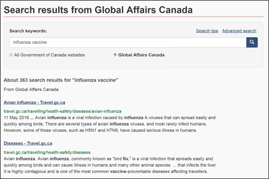
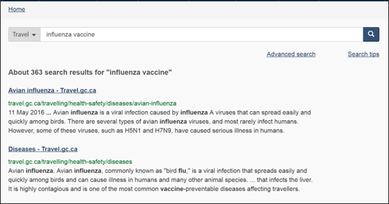
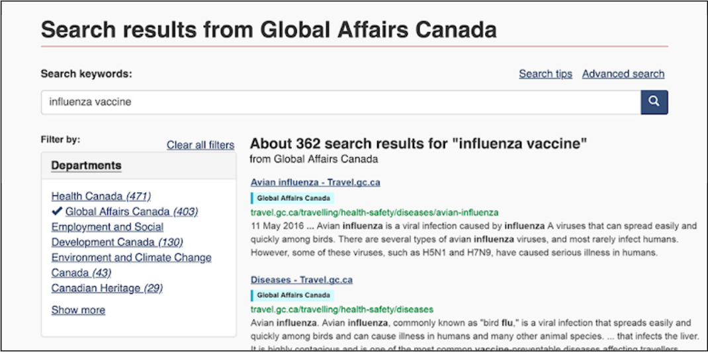
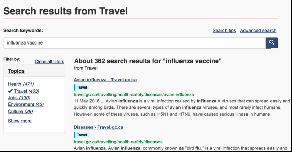
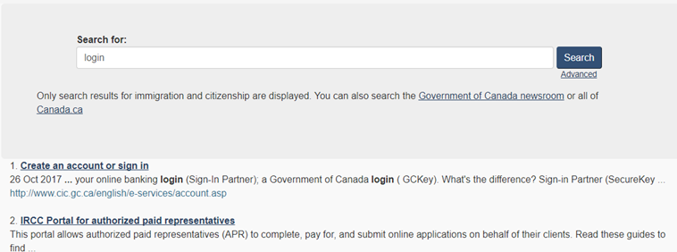

**Research question:** When site search on Canada.ca sends Canadians to a prefiltered context, such as a single department's results, can Canadians realise they aren't looking at all Canada.ca results, and find a way to cancel the context filter?

## Test information

### First click testing
* **Number of participant:** 1152 EN, 88 FR (desktop only)
* **Designs tested:** 7 (1 per participant)
* **Test period:** January 10-15 and July 6-13, 2018
* **Scenario:** “You're on the government website checking travel advisories. You decide to search for what kinds of flu are covered by this year's vaccine. After your search you get to this page. Where would you click next to find out?”

### Moderated usability testing
* **Number of participant:** 14 (mix of mobile and desktop)
* **Designs tested:** 3 (1 per participant)
* **Test period:** October, 2017
* **Scenarios:**
	* "Imagine you just finished looking at how to renew your passport and now you want to check your CRA tax account. Can you find the CRA account login page by searching for “login” in the search box?""
	* Find a way to only see the results for “login” at Health Canada without leaving this page. (You don't have to find an account page.)""
	* "Imagine you are looking for your Canada Revenue Agency (CRA) tax account from the CRA homepage, open in front of you. How would you find it? (Please note that you can use search)."

## Designs tested

### First click testing (2018)

Design 1: Contextual search, no well, bulleted link to see all:

Design 2: Contextual search, well with link under search box:

Design 3: Contextual search, well with radio buttons for context options, context byline:

Design 4: Contextual search, well with radio buttons, byline, context labels:

Design 5: Contextual search, dropdown beside search box:

Design 6: Contextual search, facet box and labels by Institution:

Design 7: Contextual search, facet box and labels by Theme:

### Moderated usability testing (2017)

Design 1: Live IRCC search (2017):

Design 2: Search results with radio button context toggle (horizontal, well):

Design 3: Search results with radio button context toggle (vertical, no well):

## Test results

### First click testing (2018)

The first click study showed a considerable amount of consistency across improvements:
* Labels in the search results account for the greatest jump in success (4, 6, 7)
* Facet box to the left of the result set was much more effective than a context toggle under the search box
* If a facet box is not available, then more successful context toggles were:
  * Associated with the search box by proximity and with a well
  * Radio buttons showing the currently selected context and the alternative did better than simply a link
  * Showing just the current context in a dropdown pattern did poorly

### Moderated usability testing (2017)

The purpose of the moderated usability testing in Oct was mostly qualitative. The design team was able to compare one of the contextual search patterns being used at the time by IRCC with a prototyped version based on a radio button interaction.

High level findings from the search results page testing:
* On all 3 designs search page designs, many participants didn’t even realize they were in automatically applied context  - need to reconsider design
  * Participants began their task on an immigration topic page. Their search took them either to the live IRCC results page or the prototyped results
* Mobile performed much worse than desktop on all designs
  * This issue was not addressed in the later first click testing.

### Recalls task performance testing (2018)

The recalls optimization project was not testing the same prototypes. It was expressly intended to test a specialised search for recalls and safety alerts.

However, a few key findings came out of the recalls study that were used to inform the search prototypes and facet designs for the longer term solution.

Specialised search findings will be summarised in a separate research summary. (Add link when available)
